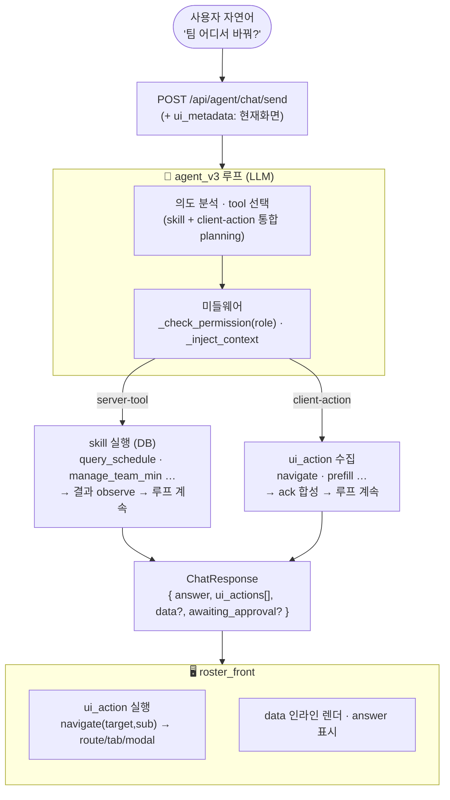

# AIDE 에이전트 — Client-Action Tool 스펙 (tool-loop 기준, 2026-05-28)

> 에이전트가 조회/설정 결과를 **텍스트로 print만 하는 단계**를 넘어,
> "팀 어디서 바꿔?", "원티드 어디서 봐?" 같은 **화면 의도** 질의에 대해
> 프론트(`roster_front`)를 실제로 이동·렌더시키기 위한 설계.
>
> 핵심 원칙: **백엔드는 컴포넌트를 모른다.** 이름 붙은 *의도(UI action)*만 내보내고,
> 프론트가 `의도 → route/tab/modal/component`를 해석·실행한다.

---

## 0. 한눈에 보기

| 항목 | 결정 |
| --- | --- |
| 전송 계약 | 기존 단일 엔드포인트 **`POST /api/agent/chat/send`** (agent_v3 루프) 위에 구축 |
| 폐기 대상 | `service/aide.ts` + `AideDevWidget.tsx` + `/aide` interrupt/resume 계약 (레거시 테스트용, 미마운트·미구현) |
| Tool 모델 | **server-tool(skill, 백엔드 실행)** vs **client-action tool(프론트 실행)** 2계층 |
| 신규 client-action | `navigate` · `prefill` · (후순위) `highlight` · (옵션) `download` |
| 환각 방지 | target은 **closed enum = route SSOT**. 없으면 emit 불가→텍스트 안내, 모호하면 되물음 |
| 권한 | client-action도 `_check_permission` 통과 — role-aware navigation (간호사를 HN전용 화면으로 보내지 않음) |
| 선행 표준 | AG-UI Protocol / CopilotKit `useFrontendTool` 와 동형 (server vs client tool) |

---

## 1. 전체 그림 — tool-loop



<details>
<summary>ASCII fallback</summary>

```
사용자 "팀 어디서 바꿔?"
   │  (+ ui_metadata: 현재 route)
   ▼
POST /api/agent/chat/send  ──►  agent_v3 루프 (LLM)
                                  │  의도분석 · tool 선택
                                  │  _check_permission(role) · _inject_context
                    ┌─────────────┴─────────────┐
            server-tool                    client-action
          skill 실행(DB)                  ui_action 수집
          결과 observe→계속               ack 합성→계속
                    └─────────────┬─────────────┘
                                  ▼
              ChatResponse { answer, ui_actions[], data?, awaiting_approval? }
                                  ▼
                        roster_front 실행
              navigate→route/tab/modal · data 렌더 · answer 표시
```
</details>

---

## 2. Tool 2계층

| | server-tool (skill) | **client-action tool (신규)** |
| --- | --- | --- |
| 실행 위치 | 백엔드 (DB 접근) | **프론트** (백엔드 실행 X) |
| 루프 처리 | 실행 → 결과 observe → 계속 | ui_action 수집 → ack 합성 → 계속 |
| 예 | query_schedule, manage_team_min, manage_grade … | navigate, prefill, highlight, download |
| 등록 | `@register` + `descriptions.SKILL_TOOLS` | 동일 포맷 + `side:"client"` 플래그 |
| 미들웨어 | `_check_permission` · `_inject_context` · `_ground_params` | `_check_permission`(role 게이팅) · `_inject_context` |

### 루프 처리 — fire-and-forget ack

agent_v3 루프가 `tool_use` 를 만나면:

- **server-tool** → 기존대로 dispatch → 결과 관찰 → 다음 결정.
- **client-action** → 백엔드가 즉시 `tool_result = {"dispatched": true, ...}` 를 **합성** → LLM이 같은 턴에 마무리 멘트 생성. ui_action 은 `AgentResult.ui_actions[]` 에 누적.
  - 네비게이션은 클라 실행 결과를 LLM이 기다릴 필요 없음 → 블로킹하지 않음.
  - (클라 실제 결과가 LLM 판단에 꼭 필요한 드문 경우용 *defer-resume* 는 현 스코프 밖.)

> 참고: 이는 AG-UI/CopilotKit의 "프론트 핸들러 실행 후 LLM에 작은 결과 회신" 모델과 동형. 여기선 ack를 백엔드에서 합성해 단일 턴으로 마무리.

---

## 3. Client-Action Tools

### 3.1 `navigate` — "어디서 봐/바꿔" 위치 의도

```jsonc
{
  "name": "navigate",
  "side": "client",
  "description": "사용자를 특정 화면/섹션으로 이동시킨다. '어디서 봐/바꿔' 같은 위치 안내 의도에 사용. 존재하지 않는 화면은 호출 불가(텍스트로 없다고 답). 후보가 모호하면 호출하지 말고 되물을 것.",
  "parameters": {
    "target": "enum(closed) — home|dashboard|wanted|roster_view|roster_view_my|nurse_management|roster_create|config|mypage|support",
    "sub":    "target별 허용 enum (선택) — nurse_management: team_setting|grade_setting / config: shift_codes|weekoff|wanted_setting",
    "query":  "{ month?, team?, nurse? } — 진입 시 프리필터 (선택)"
  }
}
```

### 3.2 `prefill` — 폼까지 채워 "확인만" 상태

```jsonc
{
  "name": "prefill",
  "side": "client",
  "description": "특정 설정 폼으로 이동 + 값을 미리 채워 사용자가 확인만 누르면 되는 상태로 만든다. 변경 의도가 명확할 때.",
  "parameters": { "target": "...", "sub": "...", "values": "{ ... }" }
}
```

- **정책**: prefill 은 화면 표시·값 채움까지만. 실제 저장은 사용자가 폼에서 confirm (또는 백엔드 skill preview→approval 과 택1, 중복 적용 금지).

### 3.3 `highlight` (후순위) — 행·요소 지목

```jsonc
{ "name": "highlight", "side": "client",
  "parameters": { "target": "...", "anchor": "{ nurse?, date?, ... }" } }
```
- 전제: 프론트 컴포넌트가 anchorable 해야 함 → 후순위.

### 3.4 `download` (옵션) — 파일 내보내기
- `roster-view/scheduleDownload.ts` 재사용.

> **답형(데이터) 응답은 ui_action 이 아니다.** 조회 결과(표/숫자)는 `data` 로 내려 위젯이 인라인 렌더.

---

## 4. Target Closed Enum = Route SSOT (+ Role)

| target | route | sub | role |
| --- | --- | --- | --- |
| `nurse_management` | `/head_nurse_management` | `team_setting`(TeamSettingModal) · `grade_setting`(GradeSettingModal) | HN·ADM |
| `config` | `/roster_configure` | `shift_codes` · `weekoff` · `wanted_setting` (탭) | HN·ADM |
| `dashboard` | `/roster_dashboard` | — | 간호사 (HN 비표시) |
| `wanted` | `/roster_wanted` | — | 전체 |
| `roster_view` / `roster_view_my` | `/roster_view` (+`/my`) | — | 전체 |
| `roster_create` | `/roster_create` | — | HN·ADM |
| `mypage` | `/myPage` | — | 전체 |
| `support` | `/support` (+`/inquiry`) | — | 전체 |

**role 게이팅 (방어 심층화)**:
1. tool description 이 LLM 에 역할별 허용 target 안내 (LLM-first).
2. middleware `_check_permission` 이 `ctx.user_role` 로 **하드 검증** — 간호사에게 HN전용 target navigate 차단.

---

## 5. 해결 규칙 — 없음 / 모호

| 상황 | 처리 |
| --- | --- |
| 없는 화면/기능 | enum 에 없음 → tool emit 불가 → LLM 이 **텍스트로 "그 화면은 없습니다"** |
| 후보 여럿 + 모호 | navigate 호출하지 말고 **assistant 가 되묻고** 다음 유저 턴 대기 |

- tool-loop 라 별도 interrupt 타입이 필요 없음 — 기존 skill `needs_clarification`(예: Z팀→A팀/B팀 제시)과 **동일 정신**.

---

## 6. 승인 무결성 — `spec_hash` 포팅 (server-tool 쪽)

현재 흐름 (`agent_v3.py`):
```
skill preview ({preview_only:True}) → _is_preview_result → awaiting_approval=True
  → 유저 "응" → _execute_approval 이 저장된 args 로 preview_only:False 재실행
```

**추가**: preview payload 에 `spec_hash` 포함 → confirm 시 재계산 hash 와 비교.
불일치(그새 상태 변동)면 즉시 재-preview. → **TOCTOU 방지** (현재의 단순 args 재호출보다 강함).
client-action 에는 불필요 (부수효과 없음).

---

## 7. 응답 Envelope (`ChatResponse` 확장)

```python
class ChatResponse(BaseModel):
    answer: str
    conversation_id: str
    awaiting_approval: bool = False        # 기존
    preview: dict | None = None            # 기존 (+ spec_hash)
    ui_actions: list[UiAction] = []        # 신규 — client-action 산출물
    data: dict | None = None               # 신규 — 답형 조회결과 (인라인 렌더)
```
- `AgentResult` 에 `ui_actions` 필드 추가 → `send` 핸들러가 그대로 직렬화.

---

## 8. `ui_metadata` (front → back readable)

```python
class ChatRequest(BaseModel):
    ...
    ui_metadata: dict | None = None   # { current_route, month, group, ... }
```
- 용도: 상대적 안내("이 화면에서 X 누르면 돼")·컨텍스트 프리필터.
- 선행 사례: CopilotKit `useCopilotReadable`.

---

## 9. Front Enabler (전제 — front 측 작은 수정)

`navigate.sub` 의 실효를 위해 필요:

| 대상 | 현재 | 필요한 수정 |
| --- | --- | --- |
| config 탭 | `useState(currentTab)` 로컬 | `navigate.sub` 받아 탭 선택 |
| nurse_management 모달 | `useState(isTeamModalOpen)` 등 로컬 | `navigate.sub` 받아 모달 open |

→ URL/네비 state 또는 위젯→front 디렉티브로 "특정 탭 선택 / 특정 모달 open" 수신.

---

## 10. 구현 순서

1. 루프의 server/client tool 분기 + `navigate`(enum + role) + `ChatResponse.ui_actions`
2. front deep-link enabler (config 탭 / nurse_management 모달)
3. `ui_metadata` (front→back 현재화면)
4. `prefill`
5. `spec_hash` 승인 강화
6. `highlight` / `download`

---

## 참고 (선행 표준)

- **AG-UI Protocol** (CopilotKit) — server-side tools vs client/frontend tools 구분.
- **CopilotKit** `useFrontendTool` / `useCopilotAction` / `useCopilotReadable` — 레퍼런스 구현.
- **Claude Code 유출 분석** — 에이전트 = 메시지배열 + tool executor + permission policy (state machine 없음) → 단일 tool-loop 정당화.
- 채택 범위: full generative-UI(컴포넌트 생성)는 과함 → **server/client tool 구분 + closed-enum** 만 차용.
