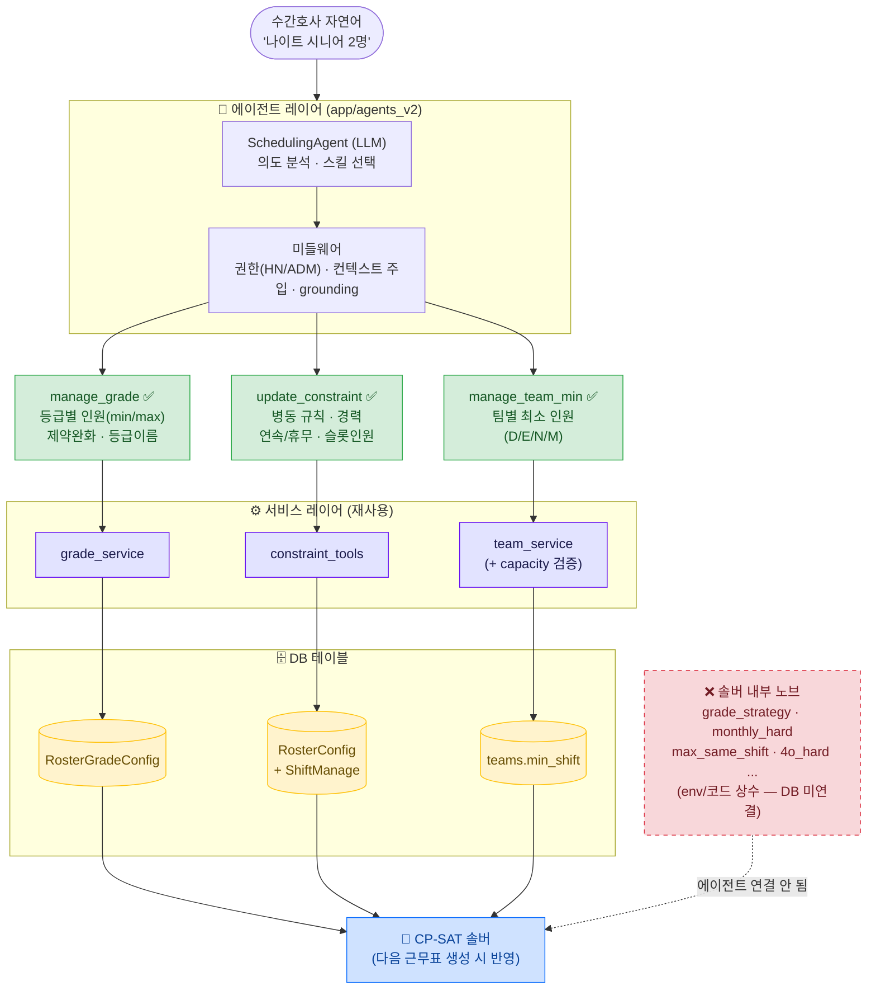
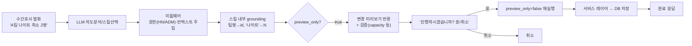

# AIDE 에이전트 — 설정(Config) 스킬 스코프 현황 (2026-05-28)

> 근무표 자동생성 에이전트(`app/agents_v2/`)의 **설정 관리 스킬** 작업 현황.
> "어떤 병동 설정을 에이전트가 자연어로 조회·변경할 수 있는가"를 한눈에 정리.

---

## 0. 한눈에 보기

| 스코프                        | 대상                                  | 스킬                       | 상태                             |
| -------------------------- | ----------------------------------- | ------------------------ | ------------------------------ |
| **A. 등급(Grade) 정책**        | `RosterGradeConfig`                 | `manage_grade`           | ✅ 완료                           |
| **B. 병동 제약(RosterConfig)** | `RosterConfig`                      | `update_constraint` (보강) | ✅ 완료                           |
| **C. 팀별 최소 인원**            | `teams.min_shift`                   | `manage_team_min`        | ✅ 완료                           |
| D. 시프트 슬롯 인원               | `ShiftManage`                       | `update_constraint`      | ✅ (기존)                         |
| **솔버 내부 노브**               | env / 코드 상수                         | —                        | ❌ 미연결 (DB 필드 없음)               |
| 조회 일관성                     | `query_schedule(constraint_config)` | —                        | ⚠️ 부분 (grade·shift_manage 미통합) |

공통 원칙(완료된 3개 스킬 전부):
- 🔒 **HN/ADM 전용** (조회 포함)
- 👁️ **preview → "응" 확인 → 적용** (실수 방지)
- 🙈 **내부 id·JSON 비노출** — 이름(등급명/팀명/시프트명)으로만 입출력

---

## 1. 전체 그림 — 설정 스킬 아키텍처



> 초록 = 완료된 설정 스킬 / 빨강 점선 = 에이전트가 아직 못 만지는 솔버 내부 노브.
> (Mermaid 미지원 뷰어용 ASCII 버전은 아래 접힌 블록 참고)

<details>
<summary>ASCII 버전 (Mermaid 렌더 안 되는 환경)</summary>

```
                       ┌─────────────────────────────┐
   수간호사 자연어  ──▶ │   SchedulingAgent (LLM)     │
   "나이트 시니어 2명"   │   의도 분석 → 스킬 선택      │
                       └───────────────┬─────────────┘
                                       │  (미들웨어: 권한·grounding)
        ┌──────────────────────────────┼──────────────────────────────┐
        ▼                              ▼                              ▼
┌───────────────┐            ┌───────────────────┐          ┌──────────────────┐
│ manage_grade  │            │ update_constraint │          │ manage_team_min  │
│   ✅ 완료      │            │   ✅ 보강 완료     │          │   ✅ 완료         │
└───────┬───────┘            └─────────┬─────────┘          └────────┬─────────┘
        ▼                              ▼                              ▼
┌───────────────┐            ┌───────────────────┐          ┌──────────────────┐
│RosterGradeConfig│          │ RosterConfig+Shift │          │  teams.min_shift │
└───────┬───────┘            └─────────┬─────────┘          └────────┬─────────┘
        └──────────────────────────────┼──────────────────────────────┘
                                        ▼
                            ┌───────────────────────┐   ❌ env/코드 상수 노브
                            │  CP-SAT 솔버           │◀┄┄ (grade_strategy 등,
                            │  (다음 근무표 생성 시)  │     에이전트 미연결)
                            └───────────────────────┘
```

</details>

---

## 2. 완료된 스코프

### 공통 — 에이전트 처리 파이프라인



---

### A. 등급(Grade) 정책 — `manage_grade` ✅

수간호사가 **등급별로 시프트에 몇 명**을 둘지 자연어로 관리.

```
   "나이트에 시니어 최소 2명"
            │
            ▼  grade 이름→번호 (병동 설정 + 실제 간호사 명부에서 후보)
   ┌────────────────────────────┐
   │ manage_grade               │   operation:
   │  • read        조회         │   ┌──────────────┐
   │  • set_requirement  min/max │   │ 못 찾으면     │
   │  • set_soft_fallback 완화   │   │ 등급 목록 +   │
   │  • set_grade_name  이름     │   │ 인원수 보여주고│
   └────────────┬───────────────┘   │ 되물음        │
                ▼                    └──────────────┘
   RosterGradeConfig
   ┌─────────────────────────────────────────────┐
   │ 솔버에 실제 도달하는 4개 필드:                  │
   │  constraints        시프트별 등급 '최소' 인원   │
   │  constraints_max    시프트별 등급 '최대'(anti)  │
   │  allow_soft_fallback 일자 제약 hard↔soft       │
   │  grade_names        등급 표시 이름 (UI/그라운딩)│
   └─────────────────────────────────────────────┘
```

핵심 동작:
- 입출력은 **등급 이름**("시니어")으로만 — 번호/JSON 비노출.
- 등급 이름 미설정이거나 못 찾으면 → **실제 간호사 명부의 등급 분포**(예: `2등급 (2명)`)를 보여주며 되물음.
- 위계 없음 → "맨 위 등급" 같은 순서 표현은 임의 해석하지 않고 되물음.

---

### B. 병동 제약(RosterConfig) — `update_constraint` 보강 ✅

기존 스킬의 **읽기 완전성 + 정책 필드 문서화**를 보강.

```
  ┌───────────────────── RosterConfig (36개 컬럼) ───────────────────┐
  │                                                                  │
  │  ✅ 조회: 이제 36개 컬럼 전부 노출                                 │
  │     (이전 누락 4개 추가: patient_amount,                          │
  │      ban_night_before_fixed_off, off_first, off_swap_enabled)    │
  │                                                                  │
  │  ✅ 자연어 변경 가능 (description 문서화):                         │
  │     ┌─[A] 필요인원·경력──────────────┐                            │
  │     │ day/eve/nig_req, off_days      │                            │
  │     │ min_exp_per_shift (경력 연차)  │ ← 신규                      │
  │     │ req_exp_nurses (경력 인원)     │ ← 신규                      │
  │     ├─[B] 연속·휴무 규칙─────────────┤                            │
  │     │ max_conseq_work, three_seq_nig │                            │
  │     │ not_one_night                  │ ← 신규                      │
  │     │ nod_noe                        │ ← 신규                      │
  │     │ ban_night_before_fixed_off     │ ← 신규                      │
  │     ├─[C] 구조 정책────────────────┤                            │
  │     │ preceptee_on, team_balance_*   │                            │
  │     │ preceptee_shift_count          │ ← 신규                      │
  │     └────────────────────────────────┘                          │
  │                                                                  │
  │  🚫 의도적 제외 (조회만 가능, 자연어 변경 X):                      │
  │     show_level, show_preceptor      (표시 전용)                   │
  │     shift_priority, weekend_shift_ratio  (불투명 float)           │
  │     team_balance_mode, off_placement_mode (enum 값 불명)          │
  │     off_first, off_swap_enabled, fixed_wanted_use_yn, use_mid     │
  │       (구조/솔버 토글 — 잘못 바꾸면 위험)                         │
  └──────────────────────────────────────────────────────────────────┘
```

> **왜 제외?** LLM이 의미를 정확히 모르는 필드를 자연어로 바꾸면 잘못 설정될 위험이 큼.
> "읽기는 투명하게 전부, 변경은 의미가 명확한 것만"이 원칙.

---

### C. 팀별 최소 인원 — `manage_team_min` ✅

"A팀은 나이트에 최소 몇 명" 같은 **팀 단위** 정책. (병동 전체도 개인도 아닌 제3의 스코프)

```
   "A팀 데이 최소 2명"
            │
            ▼  팀명→team_id, '데이'→D  (스킬 내부 grounding)
   ┌──────────────────────────┐
   │ manage_team_min          │   operation:
   │  • read       조회        │   • set_min   설정
   │  • clear_min  해제        │
   └────────────┬─────────────┘
                ▼
        capacity 검증 ──── 팀 인원 < 최소합? ──▶ ❌ "인원 부족" 거부
                │ OK
                ▼  ⚠️ payload 최소화: {team_id, min_shift} 만 전달
   teams.min_shift = {"D":2, "N":1, ...}
                ▼
        CP-SAT: team_min_by_team (데이터 있으면 자동 활성)
```

핵심 안전장치:
- `apply_team_ops`는 멤버이동·팀생성·이름변경까지 하는 함수 → 에이전트는 **`{team_id, min_shift}`만** 보내 부작용 차단.
- 저장 전 **capacity 검증**(팀 인원 < 최소 인원 합이면 거부).
- 해제: 특정 시프트만(나머지 보존) / 시프트 미지정 시 팀 전체 해제.

---

## 3. 미완성 / 제외 스코프

### 3-1. ❌ 솔버 내부 노브 — DB 미연결 (현재 에이전트로 못 만짐)

근무표 품질을 좌우하지만 **DB 설정 필드가 아니라 env/코드 상수**라 에이전트가 조정 불가.

| 노브 | 의미 | 현재 위치 |
|---|---|---|
| `grade_strategy` | 등급 제약 ON/OFF 게이트 (GRADE/COMBINED) | `roster_config` 컬럼(ORM 모델 밖, raw SQL) |
| `grade_monthly_hard` | 등급 월 합계 near-hard | 엔진 상수 (`roster_config.py`, default True) |
| `grade_penalty_weight` / `min_ratio_floor` / `min_leader_keep` | 등급 패널티·타깃 보정 | 엔진 상수 |
| 팀 min soft/hard | team_min 위반 허용 강도 | 솔버 AUTO-SOFT 재시도 정책 |
| `max_same_shift` | 같은 시프트 4연속 패널티 | 엔진 상수 |
| `n_to_n_interval_*` | N 블록 간격 soft | 엔진 상수 |
| `enforce_4o_hard` | 4연속 OFF 금지 | 엔진 상수 (default False) |

> 노출하려면 먼저 **DB 설정 필드로 승격**하는 백엔드 작업이 선행되어야 함. (현재 스코프 밖)

### 3-2. 🚫 의도적 제외 (해당 스킬에서 안 다루기로 결정)

| 항목 | 위치 | 이유 |
|---|---|---|
| `handoff_policy` | `teams.handoff_policy` | 팀 인계 제한(anti-pair) — 별도 복잡 도메인 |
| 팀 멤버 이동/생성/삭제 | `team_service` | 팀 편성 관리(별도 영역, `team_auto_assign`) |
| `null_grade_policy` | `RosterGradeConfig` | 사실상 미사용 |
| `use_dynamic_scaling` | `RosterGradeConfig` | 고정 운영 |
| `default_shifts` | `RosterGradeConfig` | 매핑용, 에이전트 조정 대상 아님 |
| 표시/불투명 RosterConfig 필드 | `RosterConfig` | 위 B의 제외 목록 참고 |

### 3-3. ⚠️ 조회 일관성 갭 (개선 여지)

```
  query_schedule(scope='constraint_config')
        └─▶ 현재: RosterConfig 만 반환  ✅
            미흡: 등급 설정(RosterGradeConfig) ❌
                  슬롯 인원(ShiftManage)        ❌
            → grade·team·slot 조회는 각 전용 스킬로 분산되어 있음
              (동작엔 문제 없으나, "설정 전부 보여줘" 한 방엔 안 모임)
```

### 3-4. (참고) 별도 트랙 — 에이전트 인프라/보안 백로그

`docs/AGENT_HANDOFF_2026-05-20.md` 의 NEXT-1~7 (운영 DB 마이그레이션, confirmation nonce, 입력/출력 보안 등)은 **설정 스코프와 무관한 별도 트랙**으로 대부분 미착수 상태.

---

## 4. 다음 후보 (우선순위 제안)

1. **조회 일관성** (3-3) — `query_schedule(constraint_config)`가 grade·team·slot 설정도 함께 반환하도록 통합. (낮은 난이도, 사용자 체감 ↑)
2. **솔버 노브 DB 승격** (3-1) — `grade_strategy` 등 핵심 노브를 DB 설정으로 올린 뒤 에이전트 연결. (백엔드 선행 작업 필요)
3. **handoff_policy 스킬** (3-2) — 팀 인계 제한을 별도 스킬로. (anti-pair 도메인 설계 필요)

---

## 부록 — 관련 파일

| 구분 | 경로 |
|---|---|
| 스킬 | `app/agents_v2/skills/manage_grade.py`, `manage_team_min.py` |
| 공유 | `app/agents_v2/skills/_shift_category.py` (시프트→D/E/N/M) |
| 제약 스킬 | `app/agents_v2/skills/update_constraint.py` |
| 설명(LLM tool schema) | `app/agents_v2/skills/descriptions.py` |
| 권한/미들웨어 | `app/agents_v2/middleware.py` (`_MUTATION_SKILLS`, `_check_permission`) |
| 서비스(재사용) | `app/services/grade_service.py`, `team_service.py`, `app/agents_v2/tools/constraint_tools.py` |
| 테스트 | `tests/agent_qa/test_manage_grade_*.py`, `test_manage_team_min_*.py`, `test_roster_config_fields.py` |
