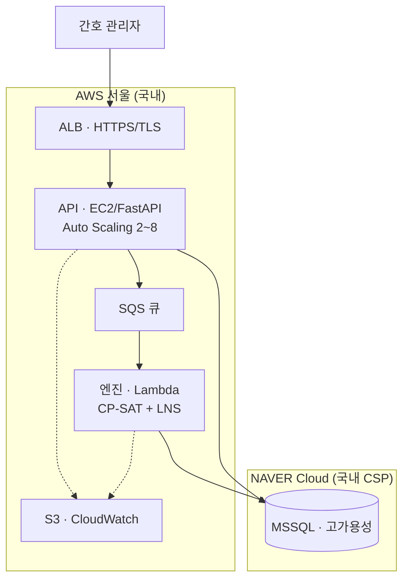

# AIDE 간호 근무표 자동생성 서비스 — 서비스 사양서

**부산대학교병원 SaaS 도입 검토용**

- 작성일: 2026-06-12
- 제공 형태: **SaaS (클라우드 기반 웹 서비스)**
- 운영 환경: **애플리케이션·연산 AWS 서울 리전(ap-northeast-2) + 데이터베이스 Naver Cloud(국내 CSP) — 전 구간 국내 보관**

---

## 1. 서비스 개요

AIDE는 간호 근무표 작성을 자동화하는 **클라우드 기반 SaaS**입니다. 간호 관리자는 별도 설치 없이 웹 브라우저만으로 근무표 생성·설정·관리 전 과정을 수행하며, 근무표 생성에 필요한 모든 연산은 당사 클라우드에서 처리됩니다. **병원 측 단말·서버 사양과 무관하게 동일한 성능을 제공**합니다.

| 항목 | 내용 |
|---|---|
| 제공 방식 | SaaS — 웹 브라우저 접속, 설치 불필요 |
| 핵심 기능 | 근무표 자동생성, 제약·규칙 설정, 희망근무(원티드) 관리, 공정성 분석, 근무 재조정 |
| 운영 환경 | AWS 클라우드, 서울 리전(ap-northeast-2) |
| 데이터 보관 | **국내(서울 리전)** — 국외 이전 없음 |
| 접속 요건 | 인터넷 연결 + 최신 웹 브라우저 |

---

## 2. 시스템 아키텍처

연산 부하가 큰 근무표 생성을 **API 계층과 분리(SQS → Lambda 서버리스)** 하여, 다수 병동이 동시에 근무표를 생성해도 API 응답성이 유지되고 연산 자원이 수요에 따라 자동 확장되는 구조입니다.

> 아키텍처 원본 다이어그램: [`architecture_busan.mmd`](./architecture_busan.mmd)

- **애플리케이션 계층(EC2 · FastAPI)**: 조회·설정·관리 등 대화형 요청을 즉시 처리. ALB로 HTTPS 종단 및 트래픽 분산.
- **연산 계층(SQS → Lambda)**: 근무표 생성 요청을 큐에 적재하고 서버리스 엔진이 비동기 처리. **상시 고사양 서버 없이 수요 기반으로만 자원을 사용**하여 비용 효율적이며, 병동 수 증가 시에도 자동 확장.
- **데이터베이스(Naver Cloud · Cloud DB for MSSQL)**: 국내 클라우드 사업자(CSP)에서 고가용성·자동 백업으로 운영. 애플리케이션~DB 구간은 국내 보안 연결로 보호.
- **스토리지(S3)·모니터링(CloudWatch)**: AWS 서울 리전. 애플리케이션·연산·데이터 **전 구간이 국내**에 위치.

---

## 3. 근무표 생성 엔진

| 항목 | 내용 |
|---|---|
| 최적화 방식 | **제약 프로그래밍 기반 조합 최적화(CP-SAT, Google OR-Tools)** 를 코어로, **강화학습(ε-greedy) 기반 적응형 대규모 이웃 탐색(Adaptive LNS)** 을 결합한 하이브리드 엔진 |
| 처리 단위 | 병동(약 20~30명) 단위 월간 근무표 |
| 반영 제약 | 근무 규칙(연속 야간·근무 간격 등), 법정·안전 제약, 등급·팀 구성, 개인 희망근무, 휴가·고정근무 등 |
| 최적화 목표 | 제약 충족을 전제로 **공정성·개인 선호 만족도 최대화**, 안전·법규 위반 최소화 |

엔진은 모든 하드 제약을 만족하는 해를 탐색한 뒤, 남은 연산 자원을 공정성·선호도 품질 향상에 사용하는 **정밀 최적화 방식**으로 동작합니다. 수작업 대비 작성 시간을 대폭 단축하면서, 사람이 놓치기 쉬운 제약 위반과 형평성 편차를 체계적으로 보정합니다.

---

## 4. 성능

| 항목 | 내용 |
|---|---|
| 근무표 생성 시간 | 병동(약 20~30명) 단위, 정밀 최적화 기준 **통상 1~2분, 최대 3분 이내** |
| 처리 방식 | 비동기 서버리스 백그라운드 처리 — 사용자 작업을 차단하지 않음 |
| 응답 예측가능성 | **연산 시간 상한이 설계상 고정(병동당 ≤ 3분)** 되어 응답시간이 예측 가능하며 지연이 폭주하지 않음 |
| 동시 처리 | 다수 병동 요청을 큐 기반으로 분산, 수요에 따라 자동 확장 |
| 대화형 기능 | 조회·설정 등은 즉시 응답 |

> 근무표 생성은 통상 **월 1회** 수행하는 배치성 업무이며 백그라운드로 처리되므로, 수 분 단위 소요가 업무 흐름에 부담을 주지 않습니다.

---

## 5. 플랫폼 처리 용량 · 인프라 구성 · 비용

본 서비스는 **다수 의료기관을 동시에 수용하는 멀티테넌트 SaaS 플랫폼**으로 운영됩니다. 부산대학교병원은 이 플랫폼의 한 기관(테넌트)으로 수용되며, 아래 용량은 **플랫폼 전체 기준**입니다. 모든 자원은 당사가 운영하는 클라우드 자원으로, 병원 측 설비 투자나 전산실 도입이 필요하지 않습니다.

### 5.1 플랫폼 처리 용량

| 항목 | 설계 기준 |
|---|---|
| 동시 접속 처리 | **API 동시 접속 2,000명** 기준 설계 (오토스케일로 그 이상 확장) |
| 인증 방식 | JWT(무상태) — API 서버 수평 확장에 제약 없음 |
| 부하 특성 | 동시접속 2,000명 ≈ 지속 ~100 RPS, 피크 ~300~500 RPS (열람·작성 think-time 반영) |
| 가용성 | 다중 AZ(가용영역) 분산, 인스턴스 장애 시 무중단 |

> 동시 접속자 수가 곧 초당 요청 수는 아니며, 실제 부하는 사용자 think-time이 반영된 요청률로 산정합니다. 부산대학교병원 단일 기관의 부하는 이 플랫폼 용량의 일부에 해당합니다.

### 5.2 인프라 구성

| 계층 | 서비스 | 사양 |
|---|---|---|
| 로드밸런서 | AWS · Application Load Balancer | HTTPS 종단, 수만 동시연결 자체 처리, 자동 확장 |
| API 서버 | AWS · EC2 (`m6i.large`) **Auto Scaling: min 2 / max 8, 다중 AZ** | 인스턴스당 ~150 RPS 처리. 지속 부하(~100 RPS)는 2대로 충분, 피크(~500 RPS) 시 최대 8대까지 자동 확장 |
| 근무표 엔진 | AWS · Lambda | 3,008 MB / 타임아웃 300초, 수요 기반 자동 확장(전 테넌트 공통) |
| 데이터베이스 | **Naver Cloud · Cloud DB for MSSQL** (4 vCPU / 16 GiB, 고가용성) | 국내 CSP, 이중화·자동 백업, 커넥션 풀링 |
| 캐시(선택) | AWS · ElastiCache(Redis) | 조회 캐시로 DB 부하 추가 경감(트래픽 증가 시 도입) |
| 스토리지 | AWS · S3 | 공유 산출물 저장 |
| 모니터링 | AWS · CloudWatch | 로그·지표 상시 모니터링 |

> 고부하 근무표 생성은 **서버리스(Lambda)가 API 계층과 분리되어 병렬·자동 확장**으로 처리하므로, 다수 병동이 월말에 동시 생성해도 API 응답성에 영향을 주지 않습니다.

### 5.3 월 운영비용 (개략, 플랫폼 전체)

> 동시접속 2,000명 처리 구성 기준. AWS 항목은 서울 리전 온디맨드 단가(2026-06), 데이터베이스는 Naver Cloud 공시 단가. 환율·약정·실 사용량에 따라 변동.

| 구성 요소 | 월 예상(원) | 비고 |
|---|---:|---|
| API 서버 (AWS EC2 `m6i.large`, Auto Scaling min 2~max 8, 다중 AZ) | 약 24만~36만 | 평균 2~3대 가동, 약정 시 추가 절감 |
| 로드밸런서 (AWS ALB) | 약 7만~14만 | 트래픽(LCU)에 비례 |
| 근무표 엔진 (AWS Lambda) | 약 1만~4만 | 사용량 기반, 유휴 시 0 |
| 스토리지·모니터링·전송 (AWS S3·CloudWatch·전송) | 약 14만~28만 | 크로스클라우드 전송 포함 |
| **데이터베이스 (Naver Cloud · Cloud DB for MSSQL, 4 vCPU/16 GiB, 고가용성)** | **약 200만** | 라이선스 포함, **비용 최대 항목(주1)** |
| **합계** | **약 246만~282만 / 월** | 약 $1,750~2,000 상당(주2) |

> **(주1)** 데이터베이스가 전체 비용의 약 70~80%를 차지합니다. **standalone(단일) 구성 시 약 113만 원**으로 낮출 수 있습니다(가용성 trade-off).
> **(주2)** 환율 1,400원/USD 가정. AWS 항목은 USD, 데이터베이스는 KRW로 청구됩니다. ElastiCache(Redis) 도입 시 월 약 15만~50만 원 추가. 정확한 산정은 트래픽·약정 조건 확정 후 제공합니다.

**비용·확장 구조의 강점**:
- **API 계층은 저비용·자동 확장**: 동시접속 2,000명 처리에 API 서버(EC2) 비용은 월 30만 원 안팎이며, Auto Scaling으로 평상시 2대 → 피크 시 최대 8대까지 트래픽에 맞춰 자동 증감.
- **연산은 사용량 기반(Lambda)**: 가장 무거운 근무표 생성을 사용한 만큼만 과금 → 다수 기관·병동이 몰려도 고정비가 급증하지 않음.
- **멀티테넌트 공유**: 단일 플랫폼이 다수 기관을 수용하므로 기관당 인프라 한계비용이 낮음.

---

## 6. 데이터 · 보안

| 항목 | 내용 |
|---|---|
| 데이터 보관 위치 | **전 구간 국내** — 애플리케이션·연산: AWS 서울 리전 / 데이터베이스: Naver Cloud(국내 CSP). 국외 이전 없음 |
| 전송 구간 보안 | HTTPS(TLS) 적용 |
| 인증 | 계정 기반 로그인, 토큰(JWT) 인증 |
| 접근 통제 | 병원·병동 단위 데이터 격리, 권한 기반 접근 |
| 로그·모니터링 | CloudWatch 기반 운영 로그·상시 모니터링 |
| 백업 | 데이터베이스 자동 백업 |

> 데이터베이스는 **국내 클라우드 사업자(Naver Cloud)** 에서 운영되며, 공공기관 민간클라우드 보안인증(CSAP) 보유 사업자입니다. 망분리·개인정보 영향평가 등 기관 보안요건은 부산대학교병원 정보보안 정책에 맞춰 협의·대응합니다.

---

## 7. 클라이언트(병원 측) 요구사항

| 항목 | 요구사항 |
|---|---|
| 단말 | 일반 사무용 PC (고사양 불필요) |
| 브라우저 | 최신 버전 Chrome(또는 최신 크로미엄 계열) |
| 네트워크 | 인터넷 연결 |
| 설치 | **불필요** (웹 접속만으로 이용) |

모든 연산이 당사 클라우드에서 처리되므로 병원 측 PC·서버 사양은 서비스 성능과 무관합니다.

---

## 8. 가용성 · 운영

| 항목 | 내용 |
|---|---|
| 배포 | CI/CD 자동 배포(무중단 지향), 운영/개발 환경 분리 |
| 확장성 | 연산 계층(Lambda) 수요 기반 자동 확장, API 계층 수평 확장 |
| 모니터링 | CloudWatch 로그·지표 기반 상시 모니터링 |
| 데이터 보호 | 데이터베이스 자동 백업, 국내 리전 보관 |

---

## 9. 도입 시 협의 항목

- 인프라 최종 산정: 부산대학교병원 **병동 수·동시 사용자 규모 확정 후** 최종 사양·비용 제시.
- 보안 요건: 기관 정보보안 정책(망분리·인증 등)에 따라 별도 협의.
- 데이터 연계: 기존 병원 시스템과의 연동 범위 협의.
