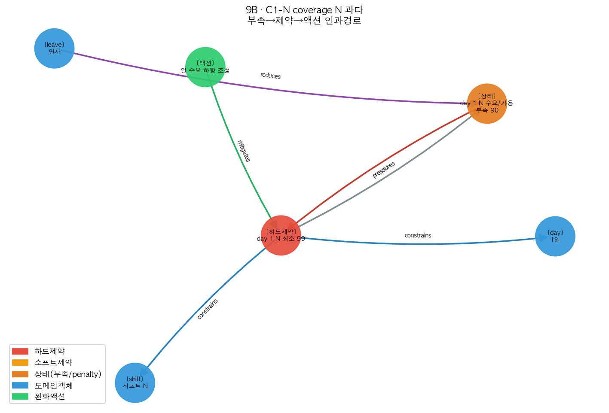
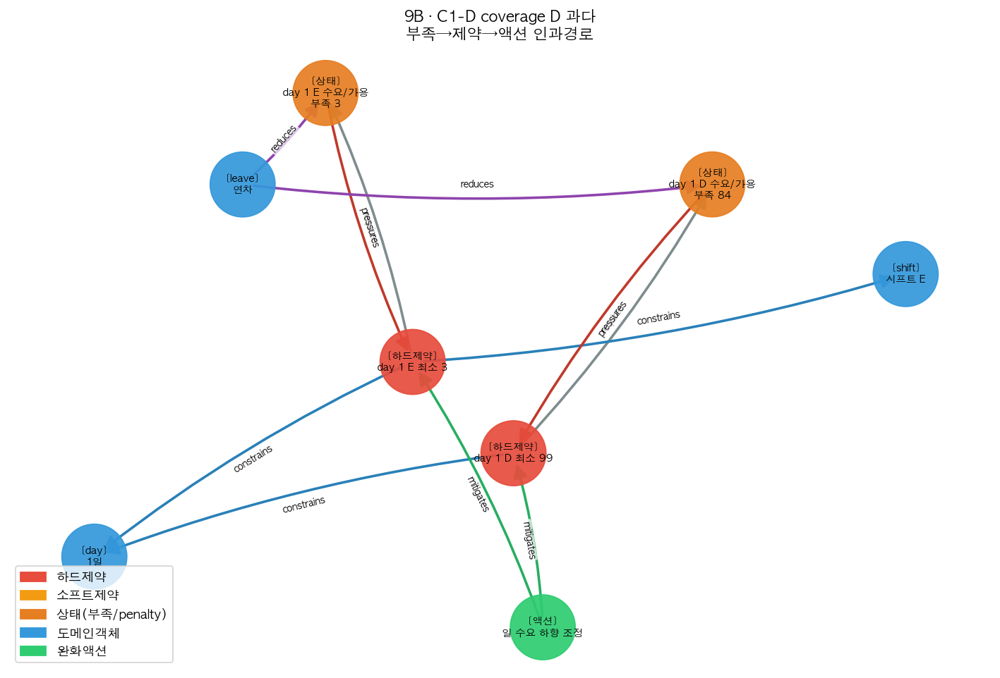
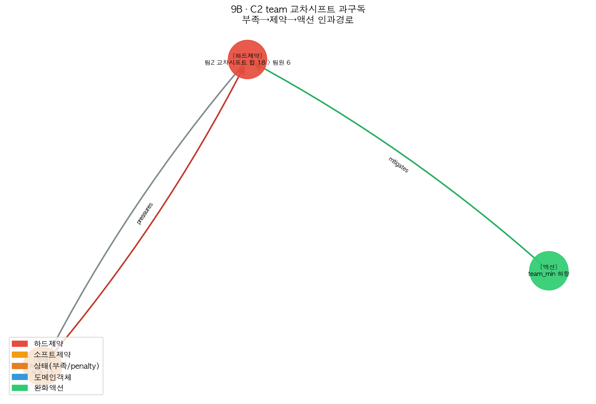
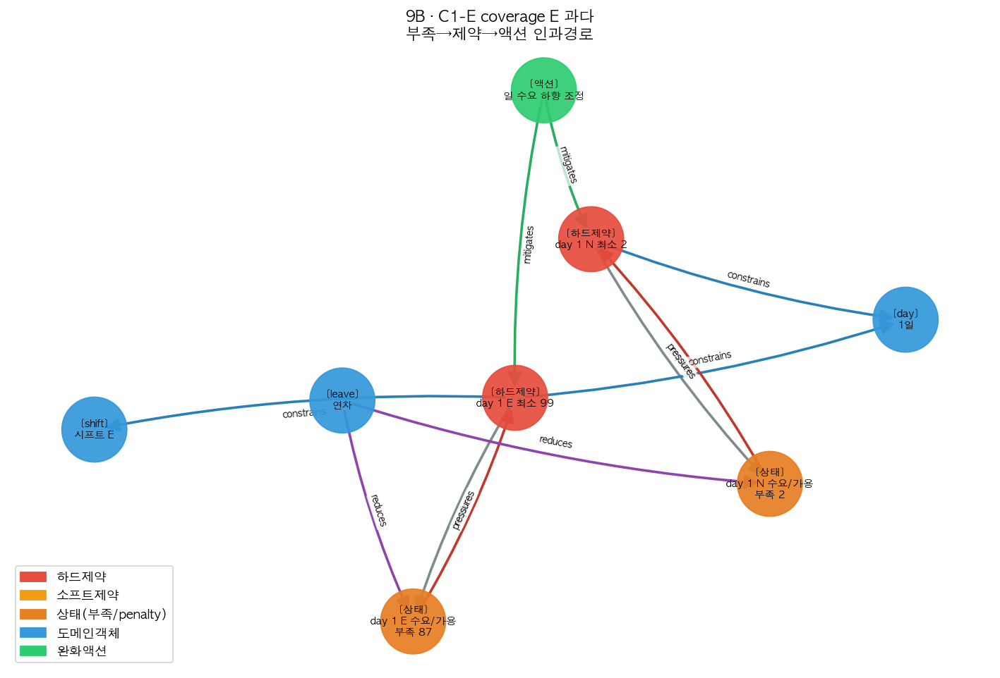
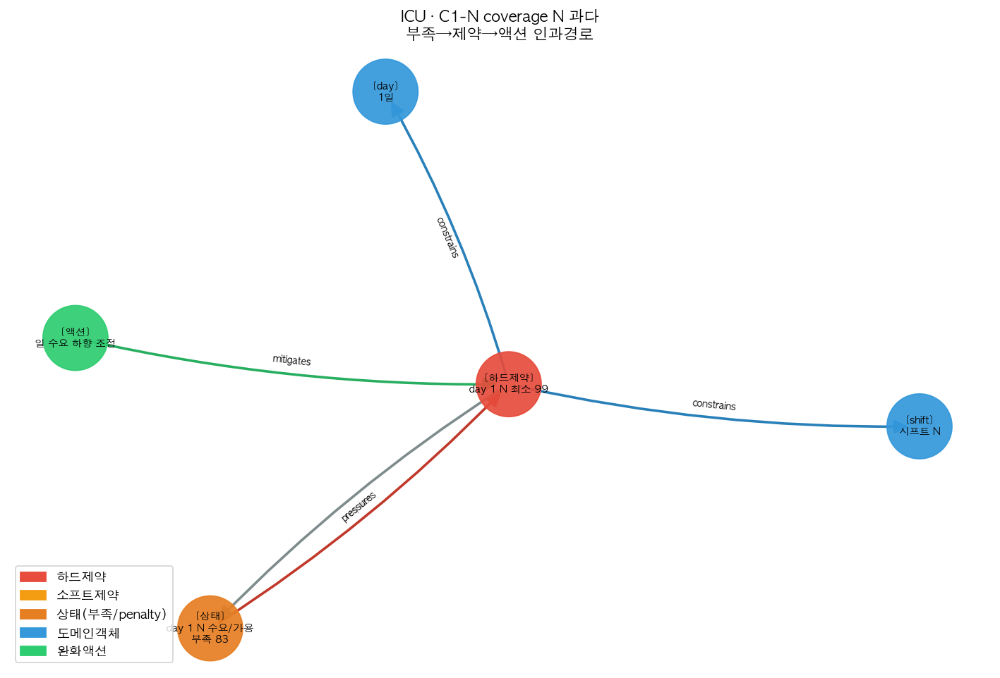
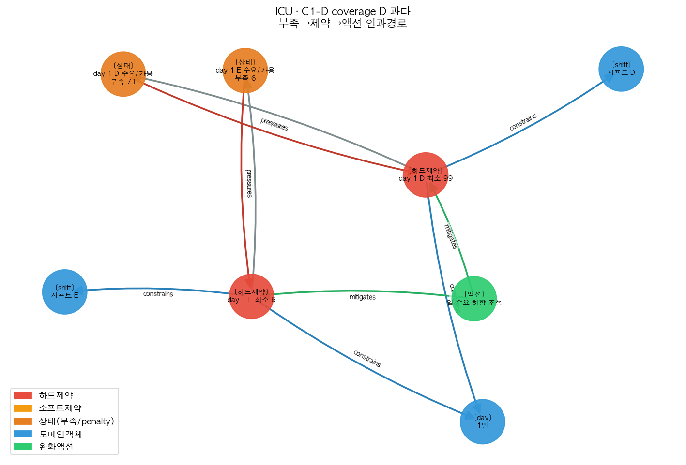
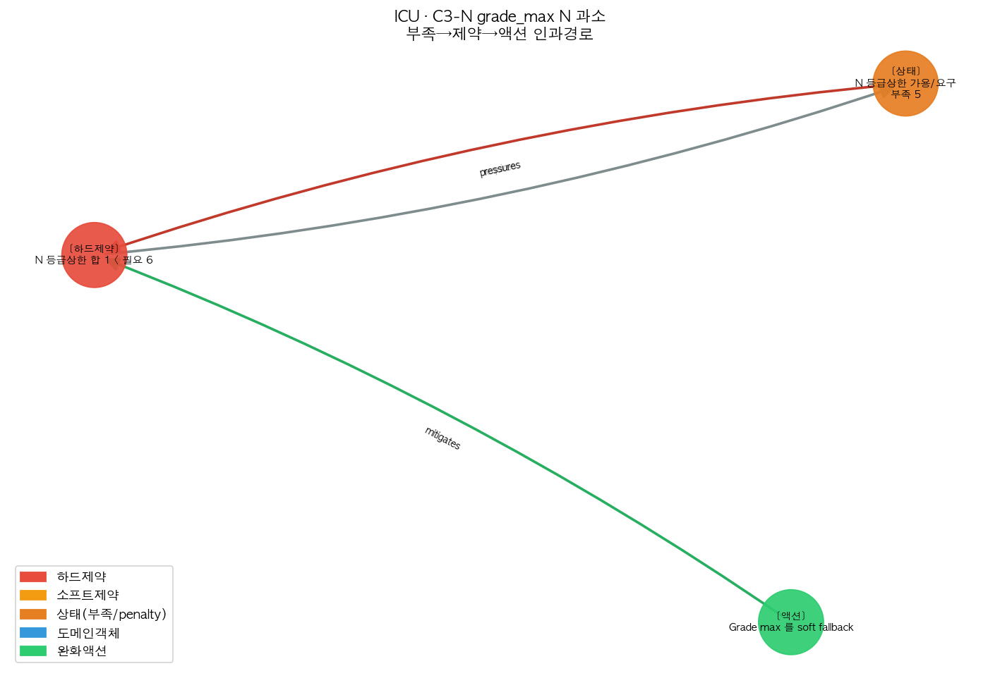
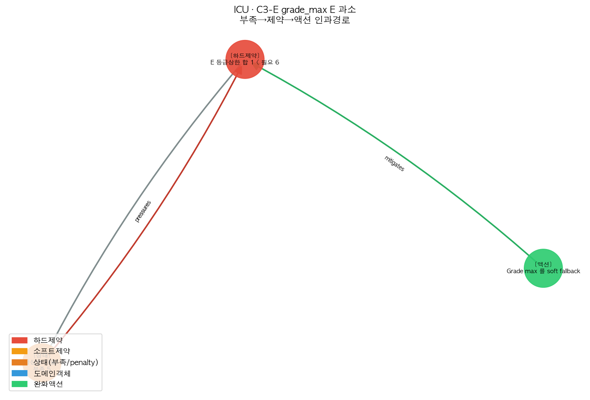
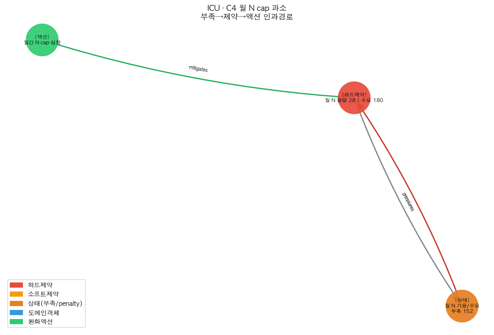

# 온톨로지 인과경로 케이스 갤러리

각 병동 실데이터(2026-06)에 하드제약 위반을 in-memory 주입 → 엔진 infeasible 확인 →
온톨로지 4-노드 그래프로 진단 → 최소변경 액션 → 적용 후 재구동 resolved.

**프로덕션 DB 무변경**(config 사본만). 그래프는 부족(state)→제약→완화(action) 인과경로.

색: 🔴하드제약 🟠소프트제약 🟠상태 🔵도메인객체 🟢완화액션 | 엣지: pressures(부족→제약), mitigates(액션→제약), requires, constrains, reduces(연차→가용)

> 각 케이스의 **🗣 실제로 한 작업**은 변수명 없이 말로 풀어 적었습니다. 표는 추적용 기술 상세입니다.

---

## 9B 병동 (간호사 15명 · 3개 팀, 5 케이스)

### 9B-1. 야간 근무 요구 인원을 터무니없이 늘림

**🗣 실제로 한 작업:** 어느 하루의 *야간 근무에 필요한 인원을 99명*으로 부풀렸습니다. 이 병동은 간호사가 15명뿐이라 그 하루의 야간을 도저히 채울 수 없어 근무표 생성이 실패(실근무 0건)했습니다. 시스템은 "그날 야간에 **요구 인원이 실제 설 수 있는 인원보다 한참 많다**"는 구조적 부족을 원인으로 짚고, **야간 요구 인원을 실제 채울 수 있는 수준으로 낮추라**고 제안했습니다. 그대로 줄였더니 근무표가 정상 생성(281건)됐습니다.

| 단계 | 내용 |
|---|---|
| ① 주입 | 특정일 야간 요구 인원을 99명으로 |
| ② 엔진 결과 | **infeasible** (실근무 0건) |
| ③ 추천 액션(최소변경) | 야간 요구 인원을 가용 수준까지 90 낮춤 |
| ④ 재구동 | **resolved** (실근무 281건) |
| ⑤ 평가 | E1 액션도출 ✅ / E2 해결 ✅ / E3 최소변경 ✅ / E5 구조원인 ✅ |

### 9B-2. 주간 근무 요구 인원을 터무니없이 늘림

**🗣 실제로 한 작업:** 이번엔 *주간 근무에 필요한 인원을 99명*으로 부풀려 그 하루를 못 채우게 만들었습니다. 시스템은 주간 수요가 가용 인력을 초과한다는 점을 짚고 **주간 요구 인원을 실제 가능한 수준으로 낮추라**고 제안 → 해결.

| 단계 | 내용 |
|---|---|
| ① 주입 | 특정일 주간 요구 인원을 99명으로 |
| ② 엔진 결과 | **infeasible** (실근무 0건) |
| ③ 추천 액션 | 주간 요구 인원을 84 낮춤 |
| ④ 재구동 | **resolved** (실근무 281건) |
| ⑤ 평가 | E1 ✅ / E2 ✅ / E3 ✅ / E5 ✅ |

### 9B-3. 한 팀에 모든 교대를 동시에 다 채우라고 요구

**🗣 실제로 한 작업:** 한 팀(팀원 6명)에게 *주간·저녁·야간 각각 6명씩(합 18명)*을 매일 동시에 세우라고 요구했습니다. 한 사람은 하루에 한 교대만 설 수 있으니 6명으로 18자리를 못 채워 불가능합니다. 시스템은 "그 팀의 **교대별 최소 인원 요구를 합하면 팀원 수를 넘는다**(과구독)"는 점을 정확히 짚고, **그 팀의 교대별 최소 인원 요구를 팀이 감당할 수준으로 낮추라**고 제안 → 해결.

| 단계 | 내용 |
|---|---|
| ① 주입 | 한 팀의 주/저녁/야간 최소 인원을 각각 팀원 수(6)로 (합 18 > 6) |
| ② 엔진 결과 | **infeasible** (실근무 0건) |
| ③ 추천 액션 | 그 팀의 교대별 최소 인원 요구를 12 낮춤(원래 수준 복원) |
| ④ 재구동 | **resolved** (실근무 281건) |
| ⑤ 평가 | E1 ✅ / E2 ✅ / E3 ✅ / E5 ✅ |

### 9B-4. 1인당 월 야간 횟수를 1회로 묶음

**🗣 실제로 한 작업:** *간호사 한 명이 한 달에 설 수 있는 야간을 1회*로 제한했습니다. 그러면 15명이 다 합쳐도 월 15번의 야간밖에 못 서는데, 한 달 야간 자리는 그보다 훨씬 많아(약 60자리) 채울 수 없습니다. 시스템은 "**월 야간 수용 능력이 야간 수요보다 부족**"함을 짚고, **1인당 월 야간 한도를 수요를 감당할 수준으로 올리라**고 제안 → 해결.

| 단계 | 내용 |
|---|---|
| ① 주입 | 1인당 월 야간 한도를 1회로 |
| ② 엔진 결과 | **infeasible** (실근무 0건) |
| ③ 추천 액션 | 1인당 월 야간 한도를 45 올림(수요 감당 수준) |
| ④ 재구동 | **resolved** (실근무 281건) |
| ⑤ 평가 | E1 ✅ / E2 ✅ / E3 ✅ / E5 ✅ |

### 9B-5. 저녁 근무 요구 인원을 터무니없이 늘림

**🗣 실제로 한 작업:** *저녁 근무에 필요한 인원을 99명*으로 부풀려 그 하루를 못 채우게 만들고, 시스템이 저녁 수요 과다를 짚어 **저녁 요구 인원을 낮추라**고 제안 → 해결.

| 단계 | 내용 |
|---|---|
| ① 주입 | 특정일 저녁 요구 인원을 99명으로 |
| ② 엔진 결과 | **infeasible** (실근무 0건) |
| ③ 추천 액션 | 저녁 요구 인원을 87 낮춤 |
| ④ 재구동 | **resolved** (실근무 281건) |
| ⑤ 평가 | E1 ✅ / E2 ✅ / E3 ✅ / E5 ✅ |

---

## ICU 병동 (간호사 28명 · 팀 구분 없음, 5 케이스)

### ICU-1. 야간 근무 요구 인원을 터무니없이 늘림

**🗣 실제로 한 작업:** 어느 하루의 *야간 요구 인원을 99명*으로 부풀려(간호사 28명) 그 하루를 못 채우게 만들었습니다. 시스템은 야간 수요가 가용 인력을 초과한다는 구조적 부족을 짚고 **야간 요구 인원을 가능한 수준으로 낮추라**고 제안 → 해결(0건→540건).

| 단계 | 내용 |
|---|---|
| ① 주입 | 특정일 야간 요구 인원을 99명으로 |
| ② 엔진 결과 | **infeasible** (실근무 0건) |
| ③ 추천 액션 | 야간 요구 인원을 83 낮춤 |
| ④ 재구동 | **resolved** (실근무 540건) |
| ⑤ 평가 | E1 ✅ / E2 ✅ / E3 ✅ / E5 ✅ |

### ICU-2. 주간 근무 요구 인원을 터무니없이 늘림

**🗣 실제로 한 작업:** *주간 요구 인원을 99명*으로 부풀려 그 하루를 못 채우게 만들고, 시스템이 주간 수요 과다를 짚어 **주간 요구 인원을 낮추라**고 제안 → 해결.

| 단계 | 내용 |
|---|---|
| ① 주입 | 특정일 주간 요구 인원을 99명으로 |
| ② 엔진 결과 | **infeasible** (실근무 0건) |
| ③ 추천 액션 | 주간 요구 인원을 71 낮춤 |
| ④ 재구동 | **resolved** (실근무 540건) |
| ⑤ 평가 | E1 ✅ / E2 ✅ / E3 ✅ / E5 ✅ |

### ICU-3. 야간에 설 수 있는 등급 상한을 전부 최저로 눌러 인력을 막음

**🗣 실제로 한 작업:** *야간에 각 등급(연차)이 설 수 있는 상한을 전부 최저로* 눌러, 야간에 배치 가능한 인원이 필요한 야간 인원보다 적어지게 만들었습니다. 시스템은 "**등급 상한을 합쳐도 야간 수요를 못 채운다**"는 점을 짚고, **그 등급 상한 규칙을 '반드시 지키는 하드'에서 '되도록 지키는 소프트'로 완화하라**고 제안 → 해결. (수요/한도 숫자를 바꾸는 대신 규칙의 강제성만 낮춘, 또 다른 종류의 최소 변경)

| 단계 | 내용 |
|---|---|
| ① 주입 | 야간 등급별 상한을 모두 최저로 (가능 인원 < 야간 수요) |
| ② 엔진 결과 | **infeasible** (실근무 0건) |
| ③ 추천 액션 | 등급 상한 규칙을 하드 → 소프트로 완화 |
| ④ 재구동 | **resolved** (실근무 540건) |
| ⑤ 평가 | E1 ✅ / E2 ✅ / E3 ✅ / E5 ✅ |

### ICU-4. 저녁에 설 수 있는 등급 상한을 전부 최저로 눌러 인력을 막음

**🗣 실제로 한 작업:** ICU-3과 같은 방식을 *저녁 근무*에 적용했습니다. 저녁 등급 상한을 전부 최저로 눌러 저녁 배치 인력을 막자 생성이 실패했고, 시스템은 **저녁 등급 상한 규칙을 소프트로 완화하라**고 제안 → 해결.

| 단계 | 내용 |
|---|---|
| ① 주입 | 저녁 등급별 상한을 모두 최저로 |
| ② 엔진 결과 | **infeasible** (실근무 0건) |
| ③ 추천 액션 | 등급 상한 규칙을 하드 → 소프트로 완화 |
| ④ 재구동 | **resolved** (실근무 540건) |
| ⑤ 평가 | E1 ✅ / E2 ✅ / E3 ✅ / E5 ✅ |

### ICU-5. 1인당 월 야간 횟수를 극단적으로 묶음

**🗣 실제로 한 작업:** *간호사 한 명의 월 야간 횟수를 1회*로 묶어, ICU의 많은 야간 수요를 도저히 못 채우게 만들었습니다. 시스템은 **월 야간 수용 능력이 수요보다 크게 부족**함을 짚고, **1인당 월 야간 한도를 수요를 감당할 수준으로 올리라**고 제안 → 해결.

| 단계 | 내용 |
|---|---|
| ① 주입 | 1인당 월 야간 한도를 1회로 |
| ② 엔진 결과 | **infeasible** (실근무 0건) |
| ③ 추천 액션 | 1인당 월 야간 한도를 152 올림 |
| ④ 재구동 | **resolved** (실근무 540건) |
| ⑤ 평가 | E1 ✅ / E2 ✅ / E3 ✅ / E5 ✅ |

---

## 한눈에 보기

| 병동 | 케이스 | 무엇을 망가뜨렸나(말로) | 시스템이 제안한 해결(말로) |
|---|---|---|---|
| 9B | 1 | 야간 요구 인원을 99명으로 | 야간 요구 인원을 가능 수준으로 낮춤 |
| 9B | 2 | 주간 요구 인원을 99명으로 | 주간 요구 인원을 낮춤 |
| 9B | 3 | 한 팀에 모든 교대를 동시에 다 채우라고 요구 | 그 팀의 교대별 최소 인원을 낮춤 |
| 9B | 4 | 1인당 월 야간을 1회로 묶음 | 1인당 월 야간 한도를 올림 |
| 9B | 5 | 저녁 요구 인원을 99명으로 | 저녁 요구 인원을 낮춤 |
| ICU | 1 | 야간 요구 인원을 99명으로 | 야간 요구 인원을 낮춤 |
| ICU | 2 | 주간 요구 인원을 99명으로 | 주간 요구 인원을 낮춤 |
| ICU | 3 | 야간 등급 상한을 전부 최저로 막음 | 등급 상한 규칙을 소프트로 완화 |
| ICU | 4 | 저녁 등급 상한을 전부 최저로 막음 | 등급 상한 규칙을 소프트로 완화 |
| ICU | 5 | 1인당 월 야간을 1회로 묶음 | 1인당 월 야간 한도를 올림 |
