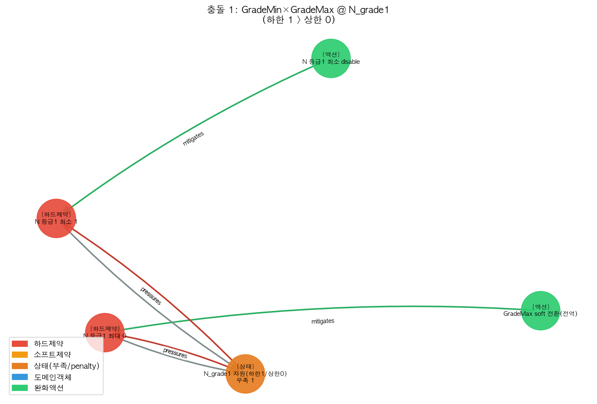
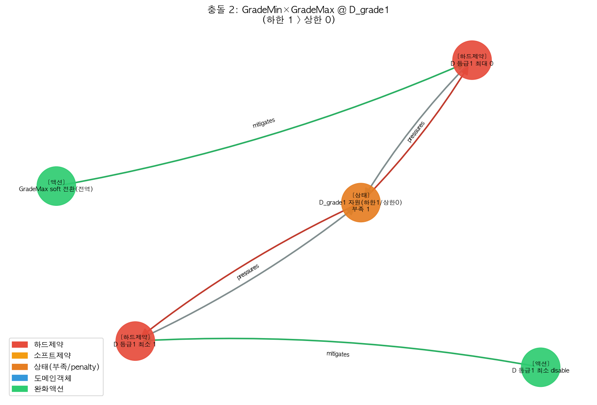

# 온톨로지 충돌(conflict) 케이스 — 그래프 진단·수선

단순 인원 부족이 아니라 **두 하드제약이 서로 모순**되는 케이스입니다.

실데이터 9B 2026-06 에 `grade_min`(등급 최소)과 `grade_max`(등급 상한)을 
서로 모순되게(최소 > 상한) 주입 → 엔진 **infeasible**.

## 한 줄 결과

- 주입 후 엔진: **infeasible** (실근무 0건)
- **같은 generic 검출기**가 충돌 **2건** 포착 (용량 부족 검출기로는 안 보임 — 부족이 아니라 모순)
- **한 액션**(GradeMax 하드→소프트)이 **2개 충돌 동시 해소**: {'action:soft:grade_max_global': ['D_grade1', 'N_grade1']}
- 수선 후 엔진: **resolved** (실근무 279건)
- 스키마 불변: 사용된 노드종류=['action', 'constraint', 'domain_object', 'state'], 엣지=['belongs_to', 'constrains', 'mitigates', 'pressures', 'reduces', 'requires'] → **4종/8엣지 내 ✅**

## 충돌 1. GradeMin ↔ GradeMax (자원 N_grade1)

| 항목 | 내용 |
|---|---|
| 충돌 구조 | `GradeMin`(≥1) 와 `GradeMax`(≤0)가 같은 자원 노드를 공유, 하한>상한(gap 1) |
| 그래프 표현 | 두 제약 ──requires──▶ 공유 capacity state ──pressures──▶ 두 제약 |
| 추천 수선(최소변경) | `GradeMax soft 전환(전역)` → `GradeMax` 완화 |
| 진단 코드 | 케이스 전용 없음 — `detect_conflicts`(floor>ceiling) 한 함수 |

## 충돌 2. GradeMin ↔ GradeMax (자원 D_grade1)

| 항목 | 내용 |
|---|---|
| 충돌 구조 | `GradeMin`(≥1) 와 `GradeMax`(≤0)가 같은 자원 노드를 공유, 하한>상한(gap 1) |
| 그래프 표현 | 두 제약 ──requires──▶ 공유 capacity state ──pressures──▶ 두 제약 |
| 추천 수선(최소변경) | `GradeMax soft 전환(전역)` → `GradeMax` 완화 |
| 진단 코드 | 케이스 전용 없음 — `detect_conflicts`(floor>ceiling) 한 함수 |

## 케이스마다 안 바뀐다는 증거

| 고정 요소 | 값 |
|---|---|
| 노드 종류 | constraint / domain_object / state / action (4종, 불변) |
| 엣지 종류 | requires·pressures·mitigates·constrains·reduces·belongs_to… (8종, 불변) |
| 충돌 검출 | `detect_conflicts` 한 함수 (family 무관) |
| 수선 추천 | `recommend_conflict_repair` 한 함수 (min/max 어느쪽이든) |
| 케이스마다 바뀌는 것 | **노드·엣지 인스턴스(데이터)뿐** — 종류·알고리즘 아님 |