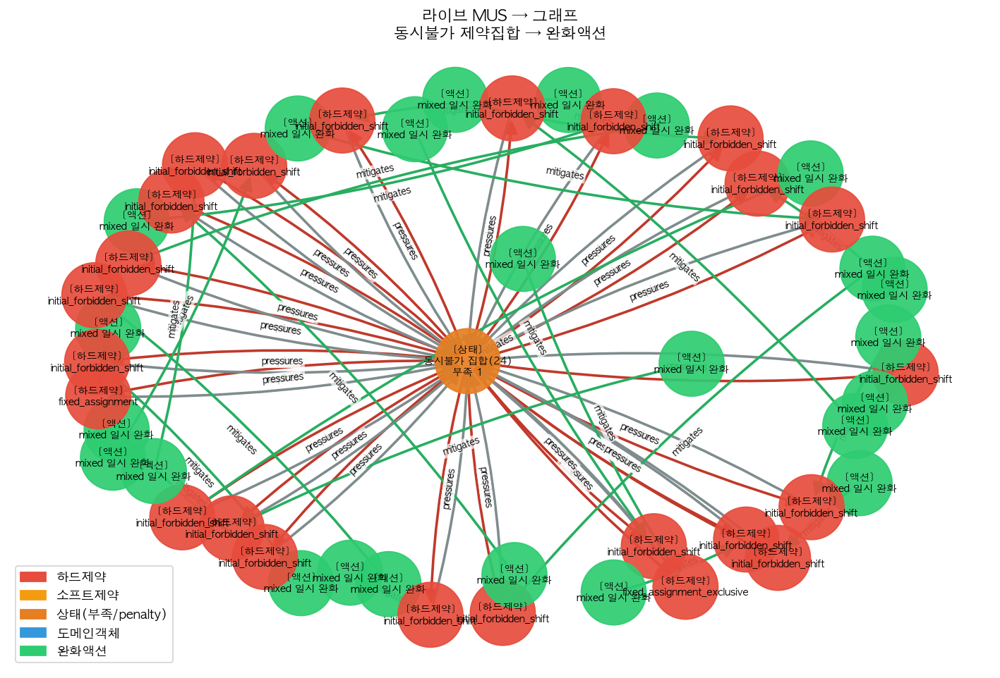

# 라이브 MUS → 그래프 진단·수선 (프로덕션 솔버 + 실데이터)

`AIDE_ENABLE_MUS_REGISTRY=1` 로 프로덕션 CP-SAT 가 실제 conflict core(MUS)를 emit →
4-노드 그래프로 bridge → 진단·수선. 연구 §4 'solver conflict → domain cause' 실증.

## 결과 (9B 2026-06)

| 단계 | 값 |
|---|---|
| baseline | feasible, 실근무 280건, MUS core 0 |
| 충돌 주입(등급 최소>상한) | **infeasible**, MUS core **20개** (패턴 {'cpsat_mus:mixed': 14, 'cpsat_mus:team_min': 2, 'cpsat_mus:grade_min': 2, 'cpsat_mus:grade_minmax_conflict': 2}) |
| 그래프 bridge | 동시불가 제약 85개 노드 ({'mixed': 30, 'BoundaryTransitionBan': 47, 'ConsecutiveWorkLimit': 1, 'team_min': 6, 'grade_min': 1}) + 완화 액션 |
| 추천 액션 | ['set_threshold:ConsecutiveWorkLimit', 'disable_module:mixed', 'disable_module:mixed'] |
| 수선 적용 후 | **resolved**, 실근무 272건 |
| 스키마 불변 | 노드 ['action', 'constraint', 'state'], 엣지 ['mitigates', 'pressures', 'requires'] (4종/8엣지 내) |

## 의미

- 용량/모순 충돌뿐 아니라 **솔버가 직접 찾은 MUS(동시불가 하드제약 집합)** 가 같은 4-노드 그래프로 올라온다.
- MUS 는 '최소 불가집합'이라 패턴이 mixed/team_min 등으로 나올 수 있음(주입 family 와 정확히 일치 안 할 수 있음) — CP-SAT MUS 의 정상 특성.
- 이로써 시퀀스/타이밍 충돌(전이금지·회복 등 wrap된 제약)도 솔버가 불가능하게 만들면 core 로 떠서 그래프 진단 대상이 된다.

## 비용 주석

- 레지스트리는 모든 하드식을 reify 해 wall-time 이 늘어 **기본 OFF**(`AIDE_ENABLE_MUS_REGISTRY`). 진단이 필요한 infeasible 분석 시에만 ON 권장.