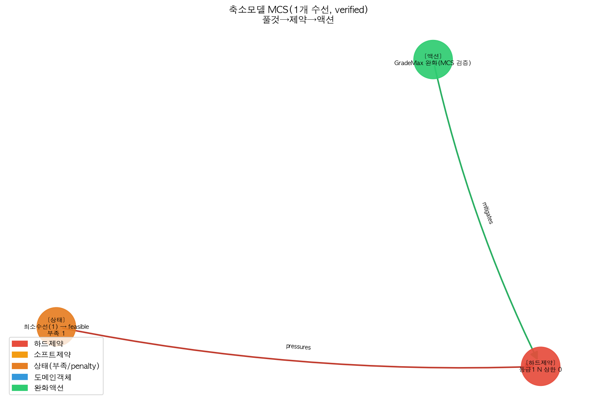

# 축소 모델 MCS — 라이브 실용화 + MUS 대조

풀 엔진에서 느린 MCS 를 '충돌 하드제약군만 담은 축소 CP-SAT 모델'로 빠르게.

## 같은 충돌, 두 방법 대조

| 방법 | 결과 | 정밀도 |
|---|---|---|
| **MUS** | core 1개 / member 1개 ({'cpsat_mus:grade_max': 1}) | 동시불가 '집합' — 무엇을 풀지 불명확 |
| **MCS** | **1개** 완화 → **verified feasible=True** (0.01s) | '이걸 풀면 됨' + 재실행 확인 |

## MCS 가 짚은 수선점 (무엇을 풀면 feasible)

- 등급1 N 상한 0 (`grade_max`)

→ 비용 가중(등급상한이 가장 쌈)으로 **최소비용 완화**를 선택. 재실행으로 feasible 확인.

## 의미

- MCS 는 0.01s 에 끝남(축소 모델). 풀 엔진은 모델만 줄여 같은 알고리즘 적용하면 됨.
- MUS 의 '집합/분산' 부정확이 MCS 에선 '검증된 최소 수선'으로 정밀해짐.
- 결과가 그대로 4-노드 그래프 액션이 되어 recommend 로 노출.