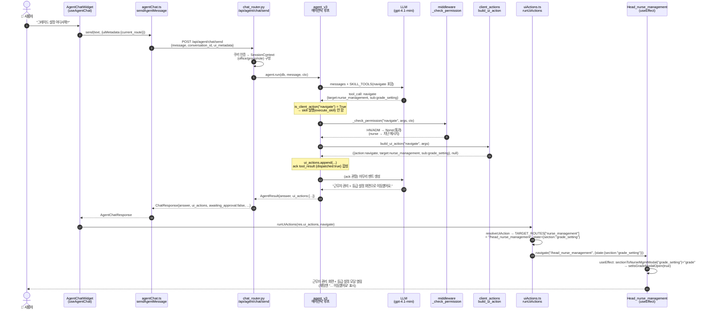
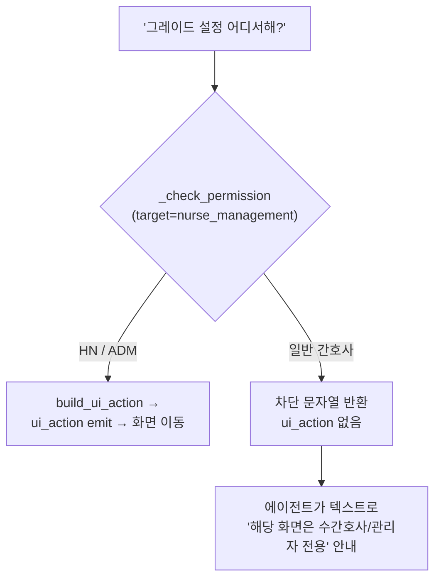

# 질의 처리 트레이스 — "그레이드 설정 어디서해?" (2026-05-29)

> 사용자가 채팅 위젯에 **"그레이드 설정 어디서해?"** 를 입력했을 때,
> 프론트 → 백엔드 에이전트 → LLM → client-action → 프론트 화면 이동까지
> **각 구간에서 무엇이 나오고 어떻게 처리되는지** 실제 캡처값으로 정리.
>
> 실측 출처: `POST /agent/test/chat` (provider=openai) 트레이스, 2026-05-29.

---

## 0. 한눈에 (실제 결과)

| 구간 | 실제 output |
|---|---|
| LLM tool 선택 | `navigate {target:"nurse_management", sub:"grade_setting"}` |
| client-action 변환 | `{action:"navigate", target:"nurse_management", sub:"grade_setting"}` |
| 최종 answer | `"근무자 관리 > 등급 설정 화면으로 이동했어요."` |
| 프론트 navigate | `navigate("/head_nurse_management", {state:{section:"grade_setting"}})` |
| 화면 결과 | 근무자 관리 페이지 + **등급 설정 모달(GradeSettingModal) 열림** |

핵심: **백엔드는 "등급설정 화면"이 어떤 route/컴포넌트인지 모른다.** 논리적 의도(`target/sub`)만 내보내고, 프론트가 `route + 모달`로 해석·실행한다.

---

## 1. 전체 시퀀스 (구간별 output)



---

## 2. 구간별 상세 — 무엇이 나오고 어떻게 처리되나

### ① UI 입력 — `AgentChatWidget.tsx` → `useAgentChat.ts`
- 입력: `"그레이드 설정 어디서해?"`
- `onSubmit` → `send(text)`. `send`가 `sendAgentMessage` 호출 + 응답의 ui_actions 실행 담당.

### ② 프론트 서비스 — `agentChat.ts` `sendAgentMessage`
- **output(요청 본문)**:
```json
{ "message": "그레이드 설정 어디서해?", "conversation_id": null,
  "year": null, "month": null, "ui_metadata": {"current_route": "/roster_view"} }
```
- `httpClient.post("/api/agent/chat/send", body)` → dlocal base(`http://localhost:8001`) + path = `http://localhost:8001/api/agent/chat/send`. 쿠키 동봉(withCredentials).

### ③ 백엔드 라우터 — `chat_router.py` `send_message`
- 쿠키 인증(`get_current_user_from_cookie`) → 미로그인 401.
- `SessionContext` 구성(office_id/group_id/nurse_id/**user_role**) + `ctx.ui_metadata = req.ui_metadata`.
- `agent.run(db, message, ctx)` 호출.

### ④ 에이전틱 루프(1턴) — `agent_v3._run_impl`
- `build_system_prompt(ctx)`(도메인 지식 + skill 설명, **navigate tool 포함**)로 메시지 구성.
- LLM 호출(`tools=SKILL_TOOLS`).
- **output(LLM tool 선택)** = `pipeline_stages`의 planning:
```
planning | skill: navigate | args: {"target":"nurse_management","sub":"grade_setting"}
```

### ⑤ client-action 분기 — `agent_v3` 루프 + `middleware._check_permission` + `client_actions.build_ui_action`
- `is_client_action("navigate")` → **True** → `execute_skill`(서버 skill 실행) **타지 않음**.
- 권한: `_check_permission("navigate", args, ctx)` → `client_actions.target_permission_error`:
  - `nurse_management`은 `hn_only=True`. **HN/ADM이면 None(통과)**, **일반 간호사면 차단 문자열** 반환(아래 §3).
- 변환: `build_ui_action("navigate", {target,sub})` →
```json
({"action":"navigate","target":"nurse_management","sub":"grade_setting"}, null)
```
- `ui_actions`에 누적 + **ack tool_result** 합성(서버 실행이 아니므로 결과 대신 확인 신호):
```json
{"dispatched": true, "action": {"action":"navigate","target":"nurse_management","sub":"grade_setting"}}
```
- **output(execution stage)**: `result: {"ui_action": {...}}`.

### ⑥ 에이전틱 루프(2턴) — 마무리 멘트
- LLM이 ack를 관찰 → 텍스트만 생성:
```
"근무자 관리 > 등급 설정 화면으로 이동했어요."
```
- `AgentResult{ answer, ui_actions:[{action:navigate,target:nurse_management,sub:grade_setting}] }`.

### ⑦ 응답 직렬화 — `chat_router` → `ChatResponse`
- **output(HTTP 응답 본문)**:
```json
{ "answer": "근무자 관리 > 등급 설정 화면으로 이동했어요.",
  "conversation_id": "…",
  "awaiting_approval": false, "preview": null,
  "ui_actions": [{"action":"navigate","target":"nurse_management","sub":"grade_setting"}],
  "data": null }
```
- 대화 상태 영속화(Redis hot + MSSQL).

### ⑧ 프론트 응답 처리 — `useAgentChat`
- `messages`에 assistant answer 추가, `conversationId` 저장.
- **`runUiActions(res.ui_actions, navigate)` 호출** — 화면 이동 실행 위임.

### ⑨ ui_action 해석 — `uiActions.ts` `resolveUiAction`/`runUiActions`
- `TARGET_ROUTES["nurse_management"]` = `"/head_nurse_management"`.
- `sub="grade_setting"` → `state = {section:"grade_setting"}`.
- **output(navigate 호출)**:
```ts
navigate("/head_nurse_management", { state: { section: "grade_setting" } })
```
- (백엔드는 route 문자열을 몰랐고, 이 매핑 테이블이 프론트의 **route SSOT**.)

### ⑩ 라우팅 + 모달 오픈 — `Head_nurse_management.tsx`
- React Router가 `/head_nurse_management` 렌더.
- `useEffect([location.state])`: `sectionToNurseMgmtModal("grade_setting")` → `"grade"` → `setIsGradeModalOpen(true)`.
- **`GradeSettingModal` 열림.**

### ⑪ 사용자 화면
- 채팅: "근무자 관리 > 등급 설정 화면으로 이동했어요."
- 화면: **근무자 관리 페이지 + 등급 설정 모달**.

---

## 3. 분기: 일반 간호사가 물으면? (권한)

등급(역량) 정보는 민감 → `nurse_management`은 `hn_only`. ⑤에서 갈림:



- 간호사: `target_permission_error` → `"해당 화면은 수간호사(HN) 또는 관리자(ADM) 전용입니다."` → `build_ui_action` 미실행 → `ui_actions=[]` → LLM이 텍스트로 안내(화면 이동 없음).

---

## 4. 코드 위치 맵

| 구간 | 파일 · 심볼 |
|---|---|
| ① UI 입력 | `roster_front/src/components/feature/aide-widget/AgentChatWidget.tsx` |
| ①·⑧·⑨ 소비 훅 | `roster_front/src/hooks/useAgentChat.ts` (`send`) |
| ② 서비스 | `roster_front/src/service/agentChat.ts` (`sendAgentMessage`, `SEND_PATH="/api/agent/chat/send"`) |
| ⑨ 매핑 | `roster_front/src/service/uiActions.ts` (`runUiActions`/`resolveUiAction`/`TARGET_ROUTES`/`sectionToNurseMgmtModal`) |
| ⑩ 모달 오픈 | `roster_front/src/pages/roster-management/Head_nurse_management.tsx` (`useEffect` → `setIsGradeModalOpen`) |
| ③·⑦ 라우터 | `roster-back-agent/app/agents_v2/chat_router.py` (`send_message`, `ChatResponse`) |
| ④⑤⑥ 루프 | `roster-back-agent/app/agents_v2/agent_v3.py` (`_run_impl` — client-action 분기) |
| ⑤ 권한 | `roster-back-agent/app/agents_v2/middleware.py` (`_check_permission`) |
| ⑤ 변환 | `roster-back-agent/app/agents_v2/skills/client_actions.py` (`build_ui_action`, `target_permission_error`, `NAVIGATE_TARGETS`) |
| ④ tool 정의 | `roster-back-agent/app/agents_v2/skills/descriptions.py` (`navigate` 스키마) |

---

## 5. 핵심 정리
1. **서버 skill vs client-action 분기**가 ⑤의 심장 — navigate는 DB를 안 치고(`execute_skill` 우회) ui_action으로 변환 + ack 합성.
2. **경계마다 output이 명확**: 요청 본문 → LLM tool_call → ui_action dict → ChatResponse → navigate 호출 → 모달 open.
3. **백엔드는 화면을 모른다**: `target/sub`(논리적)만 → `uiActions.ts`가 route/모달로 해석(프론트 SSOT).
4. **권한은 ⑤ 한 곳**: `nurse_management` hn_only → 간호사는 이동 대신 텍스트 안내.
