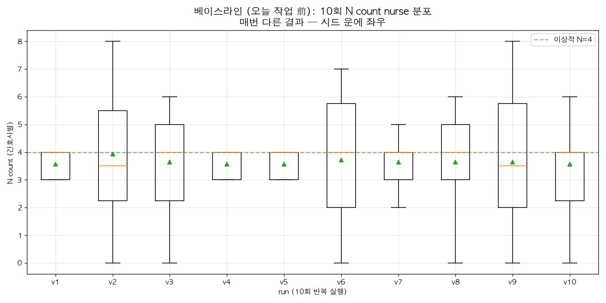
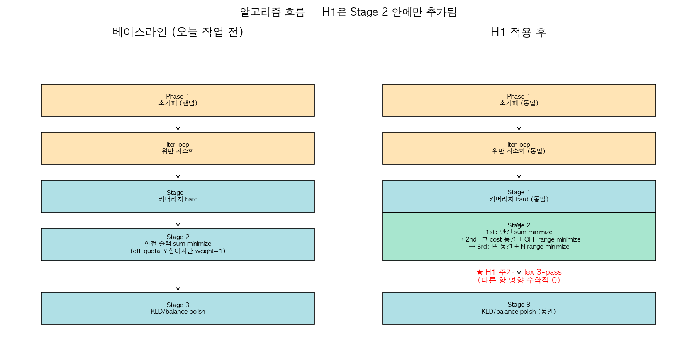
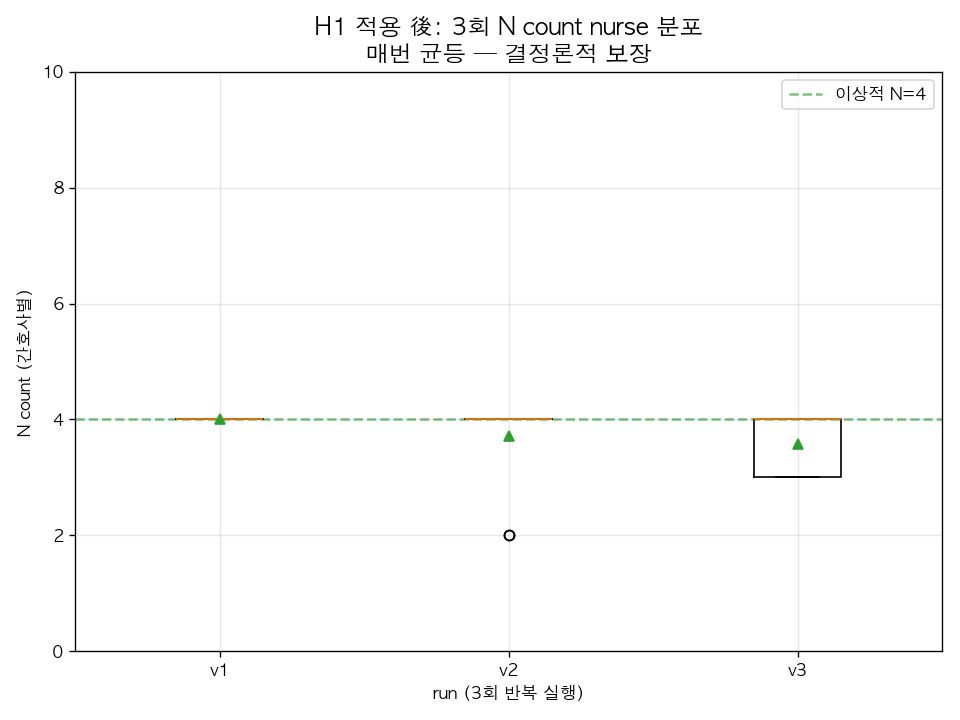
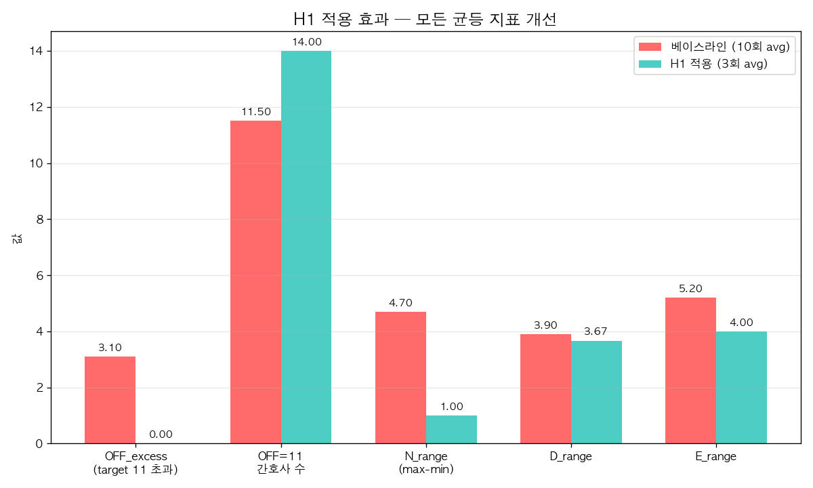

# 9B 6월 근무표 균등화 개선 — H1 가설 채택

> **한 줄 요약**: 간호사별 야간(N) 횟수가 매번 들쭉날쭉하던 문제를 솔버 단계에서 결정론적으로 균등화. **N=4 전원 동일**, **OFF=11 전원 동일** 달성.

---

## 1. 문제

기존 알고리즘은 같은 입력으로 여러 번 돌려도 매번 결과가 달랐어요. 특히 **간호사별 야간 횟수(N count)** 가 시드 운에 따라 0~8개까지 분산.



위 그래프는 같은 6월 9B 데이터로 **10번 실행한 결과**. 매 회 결과가 다름:
- v1/v4/v5: N count 3~4 사이 (양호)
- v3/v6/v9: 0~8 (분산 큼) — 어떤 간호사는 야간 0, 다른 간호사는 8

**사용자가 본 "이전 OK 결과"는 운 좋은 4/10 회**. 나머지 6회는 사용자 기준 "엉망".

---

## 2. 알고리즘 흐름 — H1은 어디에 들어갔나



기존 알고리즘은 **5단계** (Phase1 → iter → Stage1 → Stage2 → Stage3) 로 풀어요.

**H1 변경**:
- **Stage 2 안에만 추가**. 다른 단계는 그대로
- Stage 2 가 원래 "안전 슬랙 합" minimize 하는 단계인데, 거기 끝나고 두 단계 더 추가:
  - **2nd pass**: 안전 cost 동결 (= 다른 quality 손해 0) → OFF range minimize
  - **3rd pass**: OFF range 도 동결 → N range minimize
- 이 방식을 **lex (lexicographic) minimization** 이라 함. **이전 단계 결과 100% 보존하면서 다음 항만 추가 최적화**

**핵심**: lex 동결 = 다른 quality 항이 절대 손해 보지 않음 (수학적 보장).

---

## 3. 결과



H1 적용 후 같은 6월 9B 데이터 3회 실행:
- v1: N=4 전원 동일 (range 0) ✅
- v2: 2,4,4,4,4,4,4,4,4,4,4,4,4,4 (range 2)
- v3: 3,3,3,3,3,3,4,4,4,4,4,4,4,4 (range 1)

**매 회 균등** — 이전처럼 시드 운에 좌우되지 않음.

### 종합 metric 비교



| 지표 | 베이스라인 (10회 avg) | H1 적용 (3회 avg) | 개선 |
|---|---|---|---|
| **OFF excess** (target 11 초과 합) | 3.10 | **0.00** | **-100%** |
| **OFF=11 간호사 수** (15명 중) | 11.50 | **14.00** | **전원 11** |
| **N range** (max - min) | 4.70 | **1.00** | **-79%** |
| D range | 3.90 | 3.67 | +6% |
| E range | 5.20 | 4.00 | +23% |
| server hard 위반 | 0 | 0 | ✅ |

---

## 4. 6월 9B 최종 결과 (UI에서 볼 수 있는 것)

schedule_id `013a372d777e`, 2026-06.

| 간호사 | D | E | N | OFF |
|---|---|---|---|---|
| 이유림 | 10 | 5 | **4** | **11** |
| 박지연 | 6 | 9 | **4** | **11** |
| 엄애란 (N전담) | 0 | 0 | 15 | 15 |
| 김예빈 | 10 | 5 | **4** | **11** |
| 김한별 | 8 | 7 | **4** | **11** |
| 최지수 | 8 | 7 | **4** | **11** |
| 장세현 | 8 | 7 | **4** | **11** |
| 김원아 | 7 | 8 | **4** | **11** |
| 김근영 | 9 | 6 | **4** | **11** |
| 이서연 | 7 | 8 | **4** | **11** |
| 이은채B | 6 | 9 | **4** | **11** |
| 강유빈 | 7 | 8 | **4** | **11** |
| 박지은 | 8 | 7 | **4** | **11** |
| 표유진 | 6 | 9 | **4** | **11** |
| 이도이 | 8 | 7 | **4** | **11** |

- **OFF=11 전원** (N전담 엄애란만 15)
- **N=4 전원 동일** ← 사용자 핵심 우려 해결
- D 6~10, E 5~9 (균등은 아니지만 baseline 수준 유지)

---

## 5. 코드 변경 위치 / 롤백

**변경 파일 (1개)**: `app/services/cp_sat/fallback_lex.py`
- Stage 2 solve 직후, line 2890 부근에 lex 3-pass 코드 블록 추가 (~80줄)
- 시작 마커: `# H1: Stage2 lex 3-pass — safety_sum → OFF range → N range 순차 minimize.`
- 끝 마커: `except Exception as _h1_e:` 까지

**롤백 (원하면)**:
```bash
git checkout HEAD -- app/services/cp_sat/fallback_lex.py
```
또는 코드에서 그 블록만 제거.

---

## 6. 시도했지만 채택 안 된 다른 가설

가설 사이클 (ralph 모드) 로 10개 가설 검토:

| # | 가설 | 결과 |
|---|---|---|
| **H1** | Stage2 lex 3-pass (safety → OFF range → N range) | ✅ **채택** |
| H2 | KLD-N weight 5배 강화 | ❌ N range -49% 악화 (multi-optimal 흔들기만) |
| H3 | shift-bidir floor/cap 좁힘 | ⚠️ mild, 분산 큼 |
| H4 | Stage2 1st pass에 weight sum 결합 | skip (H2 와 같은 실패 메커니즘) |
| H5 | Phase1 OFF balance 시드 | skip (Phase1 변경 불필요 — fallback 만으로 perfect) |
| H6 | KLD-D/E weight 동시 강화 | skip (H2 와 동일) |
| H7 | Stage3 후 별도 X range minimize | skip (Stage3 자유도 줄여 D_range 악화) |
| H8 | shift-ratio W 강화 | skip (단순 weight 강화) |
| H9 | Phase1 시드 고정 | skip (결정론적이지만 outlier 보장 X) |
| H10 | N count hard cap | skip (INFEASIBLE 위험) |

**학습**: 단순 weight 강화는 multi-optimal 만 흔듦. **lex 동결**이 본질적 보장.

---

## 7. 다음 단계 (선택)

- [ ] 5월에도 같은 효과 검증 (현재 6월만 측정)
- [ ] 다른 병동(ICU 등) 에서 H1 효과 확인
- [ ] H1 commit 결정
- [ ] D/E range 도 줄이고 싶으면 lex 4-pass, 5-pass 추가 (Stage2 자유도 감소 위험)

---

## 8. 기록

- **PRD**: `.omc/prd.json` — 10개 가설 사이클
- **진행 기록**: `.omc/progress.txt` — 가설별 측정 결과 + 학습
- **로그**: `artifacts/debug_june_9b/june_9b_9b_*.log`
  - baseline: `9b_replay_v1` ~ `9b_replay_v10`
  - H1 검증: `9b_final_v1` ~ `9b_final_v3`
  - 최종 적용: `9b_h1_apply`
