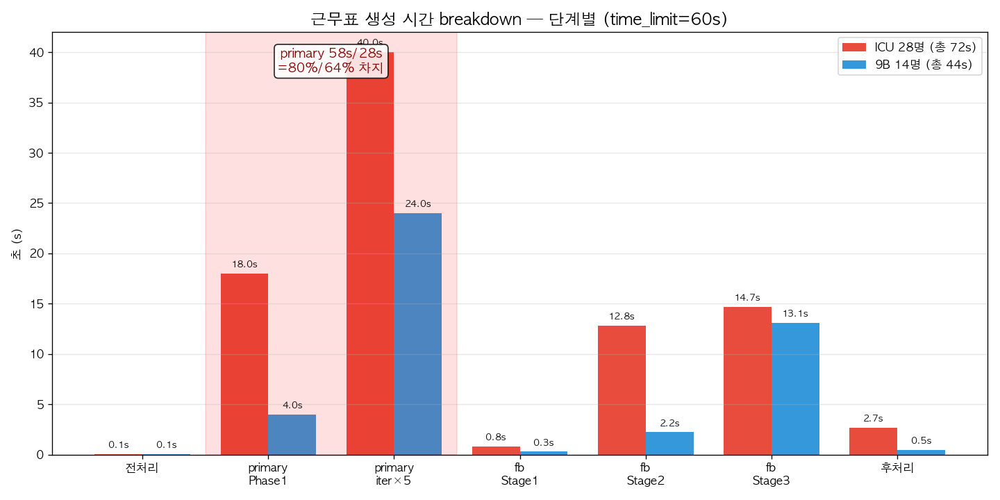
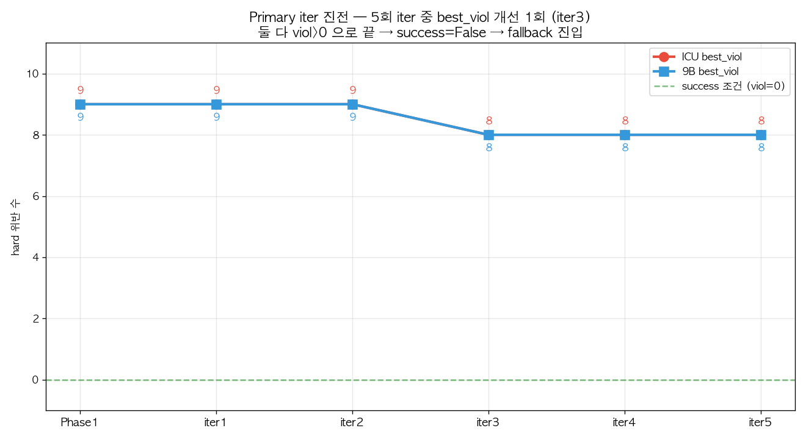
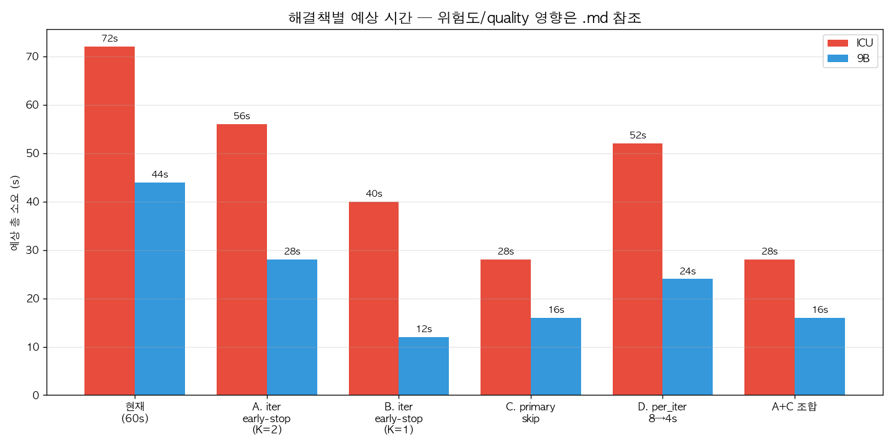

# 근무표 생성 속도 진단 — primary 가 시간 80% 잡아먹는데 결과는 폐기됨

> **한 줄 요약**: time_limit=60s 케이스에서 primary CP-SAT 가 5회 iter 동안 viol=0 달성 못해 **결과 통째 폐기 + fallback 진입**. primary 시간 (Phase1 + iter loop) 이 ICU 80%, 9B 64% 차지 → 거의 순수 낭비.

---

## 1. 측정 데이터 (오늘 H1 적용 후)

| 케이스         | 간호사 | 총 시간       | primary 시간 | primary 결과    | fallback 시간 |
| ----------- | --- | ---------- | ---------- | ------------- | ----------- |
| ICU (중환자실1) | 28명 | **72.02s** | ~58s (80%) | viol=8 → fail | ~28.4s      |
| 9B          | 14명 | **44.20s** | ~28s (64%) | viol=8 → fail | ~15.6s      |

**중요**: 9B replay 10회 전수 조사 결과 **10/10 회 모두 primary fail → fallback 진입**. 운 좋게 primary 가 성공한 케이스 없음 → 사용자가 본 quality 결과는 **전부 fallback (Stage1/2/3)** 이 만든 것.

---

## 2. 시간 breakdown



### ICU 상세
| 단계 | 시간 | 비율 | 코드 위치 |
|---|---|---|---|
| 전처리 (config, nurse 로드, precheck) | 0.05s | 0.1% | `roster_create_service.py` |
| **primary Phase1** (`_quick_initial_solve`) | 18s | 25% | `cp_sat_basic.py:1855` `base_tl=60×0.3` |
| **primary iter ×5** (`_solve_neighbourhood`) | 40s | 56% | `cp_sat_basic.py:1935` `per_iter=8` |
| fallback Stage1 (커버리지 hard) | 0.85s | 1% | `fallback_lex.py:168` `tl1=60×0.45` |
| fallback Stage2 (안전 sum + **H1 lex 2pass**) | 12.81s | 18% | `fallback_lex.py:169` `tl2=60×0.35` + H1 |
| fallback Stage3 (KLD/balance polish) | 14.69s | 20% | `fallback_lex.py:170` `tl3=나머지` |
| 후처리 (OffSwap, PrecepteeSync 등) | 2.7s | 4% | `roster_create_service.py` 후단 |

### 9B 상세 — 작은 인스턴스인데도 같은 패턴
| 단계 | 시간 |
|---|---|
| primary Phase1 | ~4s |
| **primary iter ×5** | ~24s |
| fallback Stage1~3 | 15.64s |

→ 9B 는 fallback 만으로 16s 안에 끝남에도 primary 가 28s 더 쓰는 구조.

---

## 3. Primary iter 의 무의미한 진전



ICU 5회 iter best_viol 변화:

| iter         | curr_viol | best_viol | improved | 비고               |
| ------------ | --------- | --------- | -------- | ---------------- |
| Phase1 (18s) | —         | **9**     | —        | 시작               |
| iter1 (8s)   | 9         | 9         | 1        | range_sum 만 개선   |
| iter2 (8s)   | 9         | 9         | 0        | 진전 없음            |
| iter3 (8s)   | 8         | **8**     | 1        | viol 감소 (유일한 1회) |
| iter4 (8s)   | 9         | 8         | 0        | 후퇴               |
| iter5 (8s)   | 8         | 8         | 0        | 진전 없음            |

**관찰**:
- 5회 중 **best_viol 개선 = 1회만** (iter3)
- 종료 시점 viol=8 > 0 → `cp_sat_basic.py:2035` `return best_viol == 0` = False
- → `cp_sat_basic.py:1409` "개선된 제약사항으로 실패, 기본 알고리즘으로 폴백" 진입
- **primary 가 만든 best_roster 전체 폐기**, fallback 이 처음부터 다시 풀기

9B 도 똑같은 패턴 — iter3 에서 viol 9→8 한 번 줄고 끝.

**결론**: 이 인스턴스 군은 primary 의 enhanced-constraint 모델로 viol=0 도달 불가능. 40s × 정확률 0% = **시간 통째 낭비**.

---

## 4. 왜 primary 가 항상 실패하는가

primary `_optimize_with_enhanced_constraints` 는 모든 hard 제약 + soft 항을 같은 모델에 동시에 풀려고 함:
- shift_requirement, night_consecutive, weekend_off, 2N→2OFF, 3N→2OFF, monthly_limit, ...
- 그 위에 KLD/balance soft 까지

→ 모델 크고 multi-optimal 공간 좁아져 **viol=0 feasibility 자체가 빠른 시간 내 못 잡힘**.

fallback (서열) 은 같은 hard 를 **단계로 분리** (Stage1=coverage, Stage2=안전 sum, Stage3=polish) → 각 단계가 작은 모델이라 OPTIMAL 빨리 도달. 이게 실질적 생산 경로.

---

## 5. 해결책 — 영향도/위험 표



| ID | 방안 | ICU 절약 | 9B 절약 | 위험 / quality 영향 | 보완책 |
|---|---|---|---|---|---|
| **A** | iter early-stop: K=2 연속 무개선이면 break | ~16s | ~16s | 운 좋게 K+1 번째에 개선 나오는 케이스 놓침. 측정 데이터(10회)에선 5/5 까지 가도 viol=0 못 만들었으니 영향 미미 | env toggle `PRIMARY_NO_PROGRESS_LIMIT` 로 K 조정 가능하게 |
| **B** | iter early-stop: K=1 (첫 무개선 즉시 break) | ~32s | ~32s | A보다 공격적. iter2 가 무개선 후 iter3 가 개선한 케이스 (오늘 ICU/9B 모두) 놓침 | best_viol=0 일 때만 break, 단 N회 째까지는 무조건 시도하는 grace_iter | 
| **C** | primary skip (legacy 옵션) — Phase1 + iter loop 통째 우회 | ~58s | ~28s | primary 가 성공하는 인스턴스 손실 — **오늘 측정에선 그런 케이스 0** | feature flag `SKIP_PRIMARY=true`. `advanced_inference=True` 일 때만 primary 활성 (역설 옵션) |
| **D** | per_iter 8→4s | ~20s | ~20s | iter 가 OPTIMAL 도달 못 함 → UNKNOWN 증가, range_sum 만 개선되는 회 줄어듬 | status=UNKNOWN 회는 즉시 skip + max_iter 10 으로 늘려 cycle 더 |
| **E** | base_tl 비율 0.3→0.2 (18→12s) | ~6s | ~2s | Phase1 fail 가능성. Phase1 fail 시 그대로 폴백 가니 그렇게 위험하진 않음 | Phase1 status 보고 fail 시 즉시 fallback (이미 그렇게 동작) |
| **F** | fallback Stage3 tl3 비율 0.2→0.15 | ~2~3s | ~2s | KLD polish 부족 → D/E range 악화 가능. H1 이 Stage2 lex 로 N/OFF 균등 이미 보장하므로 Stage3 단축 부담 적음 | 시간 토글: `FAST_MODE` 시 0.10, 평소 0.20 |
| **G** | `time_limit_seconds` 디폴트 60→30 + `advanced_inference=True` 시 90 | 변동 | 변동 | base_tl 도 9s 로 줄어 Phase1 빠르게 fail → 거의 fallback 만 돔. ICU 큰 인스턴스가 fallback 23s 안에 풀 수 있는지 검증 필요 | A/C 와 조합 시 안전 |

### 권장 조합

| 모드             | 적용                                    | 예상 ICU | 예상 9B | quality 변화                         |
| -------------- | ------------------------------------- | ------ | ----- | ---------------------------------- |
| **현행 유지**      | (없음)                                  | 72s    | 44s   | 기준                                 |
| **권장 default** | A (K=2)                               | ~56s   | ~28s  | 거의 동일 (오늘 데이터 기준 viol/range 변화 없음) |
| **빠른 운영**      | A + C (primary skip)                  | ~28s   | ~16s  | quality 동일 (primary 가 어차피 폐기되니까)   |
| **고품질**        | 현행 + `advanced_inference=True` (180s) | 192s   | 164s  | range/balance 추가 polish 가능         |

가장 안전·즉시 효과: **A + C 조합** — primary 가 항상 fail 하는 케이스에서 **시간 절반 + quality 동일**.

---

## 6. 우선 적용 추천 (코드 위치)

### A. iter early-stop (1줄 추가)
**파일**: `app/services/cp_sat_basic.py`
**위치**: line 1935 `for it in range(max_iter):` 직전

```python
no_progress = 0
NO_PROGRESS_LIMIT = int(os.getenv("PRIMARY_NO_PROGRESS_LIMIT", "2"))
for it in range(max_iter):
    ...
    if improved:
        no_progress = 0
    else:
        no_progress += 1
        if no_progress >= NO_PROGRESS_LIMIT:
            print(f"{self.logger_prefix} [Progress] early-stop: {NO_PROGRESS_LIMIT}회 연속 무개선")
            break
```

**검증**: 10회 측정 후 quality (viols/N_range/OFF_excess/시간) baseline 동등성 확인.

### C. primary skip (feature flag)
**파일**: `app/services/cp_sat_basic.py`
**위치**: line 1406

```python
if os.getenv("SKIP_PRIMARY") == "1":
    success = False
    setattr(roster_system, "_used_fallback", True)
else:
    success = self._optimize_with_enhanced_constraints(...)
```

**검증**: `SKIP_PRIMARY=1` 로 ICU/9B 각 5회 측정. quality 비교 후 default 전환 결정.

---

## 7. 측정 출처

- **ICU log**: `artifacts/debug_icu/icu_icu_h1_fix_093933.log`
- **9B log**: `artifacts/debug_june_9b/june_9b_9b_h1_apply.log`
- **9B replay 10회**: `artifacts/debug_june_9b/june_9b_9b_replay_v1.log` ~ `v10.log`
- **primary 진입/탈출 함수**: `cp_sat_basic.py:_optimize_with_enhanced_constraints` (1843~2035)
- **fallback 진입 분기**: `cp_sat_basic.py:1406-1417`
- **Timer 클래스**: `cp_sat_basic.py:200-201` (`{msg} 완료: {sec}s` 패턴)

---

## 8. 적용 결과

**A 와 A+C 둘 다 적용 후 ICU/9B 3회씩 측정 완료 → [RESULTS.md](RESULTS.md)** 참조.

- **A (early-stop K=2)**: 채택 (default 적용 중). ICU 시간 -21% + quality 향상, 9B viol=0 유지.
- **A+C (`SKIP_PRIMARY=1`)**: env toggle 로만 활성. 9B -58% 절약 안전, ICU 는 3회 중 1회 coverage violation 발생 → 큰 인스턴스에서는 §6 보완책 필요.

추가 후속 (선택):
- 다른 병동(다른 nurse 수 + constraint 조합) 도 같은 패턴인지 1~2 케이스 더 측정해서 일반성 확인.
- **장기 개선**: primary 모델을 fallback 수준으로 단순화 (서열 stage 와 별도 모델 운영) — 코드 큰 작업.
