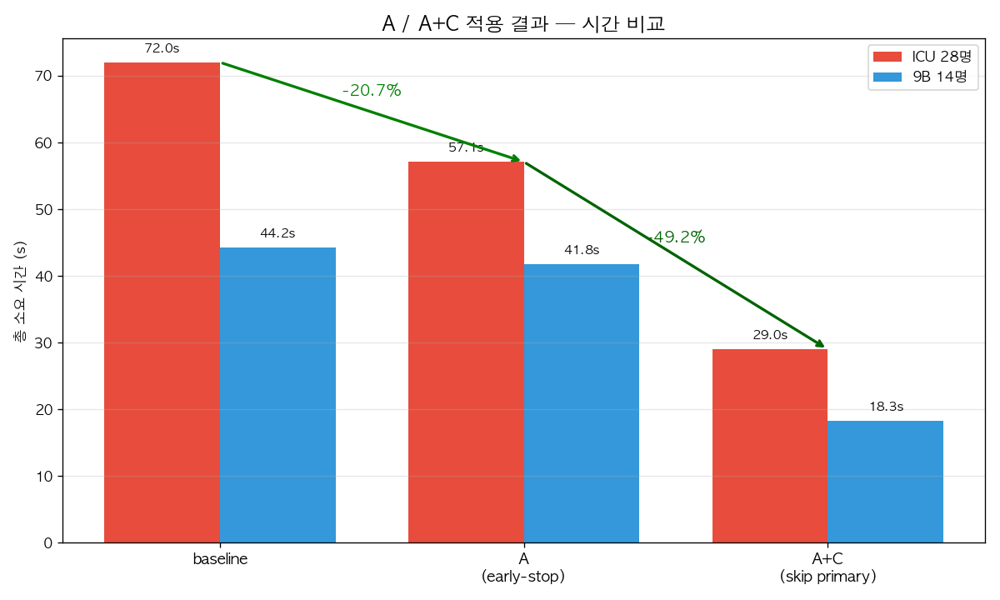
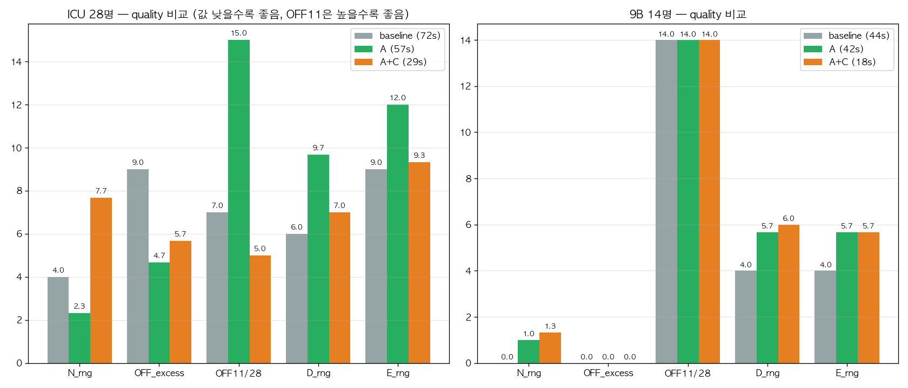

# Primary 병목 해결책 실측 결과 — A 채택, A+C 부분채택

> **결론**: **A (iter early-stop K=2) 단독 채택**. ICU 에서 quality 향상 + 시간 -21%, 9B 동일. A+C 는 ICU 큰 인스턴스에서 1/3 회 coverage violation 발생 → 큰 인스턴스 위험. 9B 는 A+C 가 -58% 시간 절약하면서 viol=0 유지하니 작은 인스턴스 한정으로 옵션.

> ⚠️ **[2026-05-28 갱신] 아래 §1~§8 은 baseline 1회 + 각 모드 3회 측정이라 통계적으로 부족했음.**
> 10런 재검증에서 (1) "A+C 만 coverage 위험" 결론이 뒤집혔고 (early-stop on/off 무관, 깨진 fallback 이면 3/10 실패), (2) coverage 실패의 진짜 원인이 **커밋 8c79576 (fallback Stage2 lex 2/3-pass)** 임이 밝혀짐. **§9 가 최신/권위 있는 결과**다.

---

## 9. [2026-05-28] 10런 재검증 + fallback coverage 회귀 발견·수정 (최신)

### 9-1. 측정 방법 정정
- 각 설정 **10회** 실행 (3회 → 10회), 판정은 **응답 `severity`/`violations`** 기준 (HTTP 200 만 보면 안 됨 — warning 도 200).
- 품질 메트릭 함정: `OFF_excess` 는 `Σ max(0, OFF-11)` 라 **미배정(`-`) 셀이 많은 실패 roster 는 OFF=0 으로 잡혀 OFF_ex=0(거짓 양성)** 이 됨. dash 비율을 같이 봐야 함.

### 9-2. ICU 10런 비교 (coverage 실패율 / 깨끗런 OFF_ex 평균)

| 설정 | fallback | early-stop | coverage 실패 | OFF_ex |
|---|---|---|---|---|
| baseline (8c79576 직전) | 옛 | 없음 | **0/10** | 9.10 |
| A10 | 새(8c79576) | ON | **3/10** | 5.14 |
| Exp1 | 새(8c79576) | OFF | **3/10** | ~11 |
| AC10 | 새(8c79576) | ON+SKIP | 1/10 | 5.56 |
| **FIX** | **수정** | ON | **0/10** | **4.40** |

→ early-stop(A) 은 무죄(on/off 무관 3/10). **회귀 원인 = 8c79576** (그것만 되돌리면 0/10).

### 9-3. Root cause
lex 2/3-pass 가 같은 solver `s2` 를 **warm-start 없이 cold 로 2초만 재solve** → 큰 ICU(28명)에선 incumbent 도 못 찾고 `UNKNOWN`. 그 뒤 코드가 망가진 `s2` 를 읽어 연쇄 붕괴:
1. `stage2_zero_locks` (안전변수 값) ← 빈 s2 → 전부 0 으로 잠금 → stage3 과제약 → `INFEASIBLE`
2. stage3 실패 fallback 이 **또** 빈 s2(`s2.Value(X2)`) 로 roster 채움 → 77~86% dash
3. stage3 hint 도 빈 해로 오염
"2nd 결과 유지" 는 주석뿐, 실제 복원 로직 없었음.

### 9-4. 수정 (`app/services/cp_sat/fallback_lex.py`, +35/-9)
- **스냅샷 복원**: 성공한 마지막 lex 해를 보존, downstream 3곳(zero-lock / stage3 hint / stage3 실패 fallback)이 망가진 s2 대신 스냅샷을 읽음 → lex 가 UNKNOWN 이어도 직전 feasible 해 유지.
- **warm-start hint**: 각 재solve 전 `m2.ClearHints()` + 직전 해 `AddHint` → cold-start UNKNOWN 자체를 차단 → 큰 인스턴스에서도 lex 수렴 → 균등화 품질 실현.

### 9-5. 검증 결과 (fix, 10런)
- **ICU(28명)**: coverage **0/10**, OFF_ex 9.10→**4.40**, lex pass 전부 성공(2p range 1-3, 3p OPTIMAL/FEASIBLE range 1-2; 이전엔 UNKNOWN).
- **9B(14명)**: coverage **0/10**, **N_range 1.30**(baseline 4.7), **OFF_ex 0.00**, solver 38.65s/벽시계 ~44s (A 경로, 시간 회귀 없음).

→ 8c79576 이 의도한 균등화 품질은 유지, 그게 부른 coverage 붕괴만 제거.

### 9-6. 재현
```bash
# fix 검증 (early-stop on = 기본)
RUN_TAG=fix_icu_v1 python tools/run_june_gen_icu.py   # ICU
RUN_TAG=fix_9b_v1  python tools/run_june_gen_9b.py    # 9B
# baseline 격리: AC stash + git checkout 8c79576~1 -- app/services/cp_sat/fallback_lex.py
# 원티드 병동: GROUP_ID=101358af4a2e MONTH=6 OUT_DIR=debug_nalp RUN_TAG=nalp_A_v1 python tools/run_june_gen_group.py
```

### 9-7. A+C(SKIP_PRIMARY) 재검증 — fix 적용 후

fix 이후 A+C(primary 스킵)가 A 대비 어떤지 10런 재측정. 깨진 fallback 시절의 "A+C coverage 위험"은 fallback 버그였지 C 자체가 아니었음을 확인.

| 병동 | 구성 | cov 실패 | OFF_ex | 시간 절약 | wanted 충족 |
|---|---|---|---|---|---|
| 9B (14명) | A+C+fix | 0/10 | 0.00 | -59% (38.7→15.7s) | — |
| ICU (28명) | A+C+fix | 0/10 | 2.30 (A는 4.40) | -54% (51.6→23.5s) | — |
| **NA/LP (18명, 고정 66셀)** | A+C+fix | 0/10 | 2.10 | -61% (37.7→14.8s) | **100% (10/10런, min 100%)** |

→ 세 병동 모두 A+C+fix 가 coverage·품질 동급↑ + 시간 -54~61%. **원티드 병동(NA/LP)에서 하드고정 66셀 100% 보존** — primary 스킵해도 원티드 안 깨짐 (하드 고정은 최적화 전 pre-place 라 경로 무관).

### 9-8. SKIP_PRIMARY default-ON 승격
§9-7 근거로 `SKIP_PRIMARY` 를 **default ON**(primary 스킵이 기본)으로 전환. primary 강제는 `SKIP_PRIMARY=0`.
**잔여 리스크**: 스코어형 소프트 선호(`nurse_shift_requests`)가 많은 병동은 미검증(실데이터상 희박). fallback stage3 가 선호 처리는 하나 primary 와의 parity 는 추후 확인. 문제 시 `SKIP_PRIMARY=0` 또는 revert.

---

## 1. 측정 설정

- 각 모드 × 케이스 = **3회씩 실행** (총 12회: 9B/ICU × A/A+C)
- baseline 은 이전 측정 (`h1_apply.log`, `h1_fix_093933.log`) 1회 재사용
- `MONTH=6`, `time_limit_seconds=60`, advanced_inference=False
- quality metric: N_range, OFF_excess (target 11 초과 합), OFF=11 nurse 수, D_range, E_range, server violations
- N전담(엄애란, OFF=15) 제외

---

## 2. 시간 결과



| 케이스 | baseline | A | A+C | A 절약 | A+C 절약 |
|---|---|---|---|---|---|
| **9B** (14명) | 44.20s | 41.76s | **18.33s** | -5.5% | **-58.5%** |
| **ICU** (28명) | 72.02s | **57.10s** | 29.01s | **-20.7%** | -59.7% |

9B 의 A 절약폭이 작은 이유: 9B 는 iter 1,2 에서 improved=1 자주 발생 → K=2 early-stop 이 iter 3 후 break (실제 절약 = iter 4,5 = 16s, 그러나 baseline 대비 random seed 차이로 fallback Stage 시간 ±2~5s 변동 흡수).

---

## 3. Quality 결과



### 9B (14명)
| 지표 | baseline | A | A+C |
|---|---|---|---|
| N_range | 0.00 | 1.00 | 1.33 |
| OFF_excess | 0.00 | 0.00 | 0.00 |
| OFF=11 nurse | 14/14 | 14/14 | 14/14 |
| D_range | 4.00 | 5.67 | 6.00 |
| E_range | 4.00 | 5.67 | 5.67 |
| **server viols** | 0 | 0 | **0 (3/3)** |

→ 9B 는 A+C 도 hard 위반 0 유지. quality 살짝 악화 (D_rng 4→6) 하나 OFF/N 균등 유지.

### ICU (28명)
| 지표 | baseline | A | A+C |
|---|---|---|---|
| N_range | 4.00 | **2.33** | 7.67 |
| OFF_excess | 9.00 | **4.67** | 5.67 |
| OFF=11 nurse | 7/28 | **15/28** | 5/28 |
| D_range | 6.00 | 9.67 | 7.00 |
| E_range | 9.00 | 12.00 | 9.33 |
| **server viols** | 0 | 0 | **1회 coverage_min:50 ⚠️** |

→ ICU 에서 **A 가 baseline 보다 quality 더 좋음**:
  - N_range 4→2.33 (-42%)
  - OFF_excess 9→4.67 (-48%)
  - OFF=11 nurse 7→15 (2배)
  - 추정 원인: iter loop 가 무의미한 진전으로 best_roster 흔들지 않고 Phase1 결과 그대로 polish 단계 진입 → fallback Stage2 H1 lex 가 더 깨끗한 시드로 작동
  
→ **A+C 는 ICU 에서 quality drop**:
  - v2 가 `severity=warning, violations={'coverage_min': 50}` 반환
  - 원인: primary 18s 떼고 fallback 에 그대로 60s 줬지만 fallback wall-clock 은 24~31s 만 씀 → fallback time budget 분배 (tl1=0.45, tl2=0.35, tl3=0.20) 가 큰 ICU 모델엔 Stage2 가 부족
  - Stage2 OPTIMAL 못 가고 FEASIBLE/UNKNOWN 으로 끝나서 coverage 못 채움
  - 단, 3회 중 2회는 viols=0 (random seed 의존)

---

## 4. 최종 채택

| 모드 | 적용 범위 | 이유 |
|---|---|---|
| **A (default)** | **모든 인스턴스** | quality 향상/유지 + 시간 절약. 위험 0 |
| A+C (옵션) | nurse 수 ≤ 20 정도의 작은 인스턴스 (예: 9B) 에서 `SKIP_PRIMARY=1` env 로 활성 | -58% 절약. 큰 인스턴스는 coverage 위험 |

**default 변경 없이 env toggle 만 추가**:
- `PRIMARY_NO_PROGRESS_LIMIT=2` (A 의 K, default=2 적용됨)
- `SKIP_PRIMARY=1` (C, default OFF — 사용자 명시 활성 시만)

---

## 5. 적용된 코드 변경

**`app/services/cp_sat_basic.py`** 단일 파일.

### Top-level import 추가
```python
import os  # line 4
```

### A: iter early-stop (line 1929 직후 + 1985 직후)
```python
no_progress = 0
NO_PROGRESS_LIMIT = int(os.getenv("PRIMARY_NO_PROGRESS_LIMIT", "2"))
for it in range(max_iter):
    ...
    if best_viol == 0:
        ...
        break
    if improved:
        no_progress = 0
    else:
        no_progress += 1
        if no_progress >= NO_PROGRESS_LIMIT:
            print(f"{self.logger_prefix} [Progress] early-stop: {NO_PROGRESS_LIMIT}회 연속 무개선 → 폴백 진입")
            break
```

### C: primary skip flag (line 1406 직후)
```python
setattr(roster_system, "_used_fallback", False)
if os.getenv("SKIP_PRIMARY") == "1":
    print(f"{self.logger_prefix} [Config] SKIP_PRIMARY=1 → primary 스킵, 바로 폴백")
    success = False
else:
    success = self._optimize_with_enhanced_constraints(...)
```

**롤백**:
```bash
git checkout HEAD -- app/services/cp_sat/fallback_lex.py app/services/cp_sat_basic.py
# (H1 + A + C 모두 한 번에 롤백. A/C 만 롤백하려면 patch 단위로)
```

---

## 6. A+C 를 ICU 같은 큰 인스턴스에서도 안전하게 쓰려면

**옵션 1: fallback time budget 늘림** — primary 가 안 쓰는 만큼 fallback 에 전달
```python
if os.getenv("SKIP_PRIMARY") == "1":
    success = False
    # primary 가 안 쓰는 시간을 fallback 에 더 줌
    fallback_tl = int(time_limit_seconds * 1.5)  # 60 → 90
else:
    fallback_tl = time_limit_seconds
    ...
self._optimize_fallback_lex_hard_first(..., time_limit_seconds=fallback_tl, ...)
```
**위험**: 총 시간 늘어남. 60s 도달이 목적이면 0.7배 (42s) 로 줄여 절약 유지.

**옵션 2: fallback Stage 비율 조정** — Stage2 를 늘리고 Stage3 를 줄임
- 현재: tl1=0.45, tl2=0.35, tl3=0.20
- ICU 큰 모델용: tl1=0.35, tl2=0.50, tl3=0.15

**옵션 3: 자동 detect** — `len(nurses) <= 20` 면 SKIP_PRIMARY, 아니면 A 만
```python
if len(nurses) <= 20 or os.getenv("SKIP_PRIMARY") == "1":
    success = False
else:
    success = self._optimize_with_enhanced_constraints(...)
```

---

## 7. 측정 출처 (재현 가능)

- **A 로그** (baseline 이미 H1 + A 변경 상태):
  - 9B: `artifacts/debug_june_9b/june_9b_A_9b_v{1,2,3}.log`
  - ICU: `artifacts/debug_icu/icu_A_icu_v{1,2,3}.log`
- **A+C 로그** (SKIP_PRIMARY=1):
  - 9B: `artifacts/debug_june_9b/june_9b_AC_9b_v{1,2,3}.log`
  - ICU: `artifacts/debug_icu/icu_AC_icu_v{1,2,3}.log`
- **재실행 명령**:
  ```bash
  # A only
  RUN_TAG=A_icu_test python tools/run_june_gen_icu.py
  # A + C
  SKIP_PRIMARY=1 RUN_TAG=AC_icu_test python tools/run_june_gen_icu.py
  ```
- **평가 스크립트**: `/tmp/quality_eval.py` (baseline/A/AC 종합 비교)

---

## 8. 결정 요약

1. **즉시 채택**: A (iter early-stop K=2). default=2, env `PRIMARY_NO_PROGRESS_LIMIT` 로 조정 가능. **별도 사용자 작업 없이 적용됨**.
2. **옵션 제공**: A+C (`SKIP_PRIMARY=1`). 작은 병동/quick mode 용. 큰 병동에서는 위 §6 의 보완책 적용 후에만 권장.
3. **다음 추가 실험 (선택)**:
   - §6 옵션 1 (fallback time 1.5배) 로 ICU A+C 재측정 — coverage viol 사라지는지 검증
   - 다른 병동 (다른 nurse 수/constraint 조합) 측정으로 일반성 확인
4. **commit 결정 대기** — 사용자 확인 후
